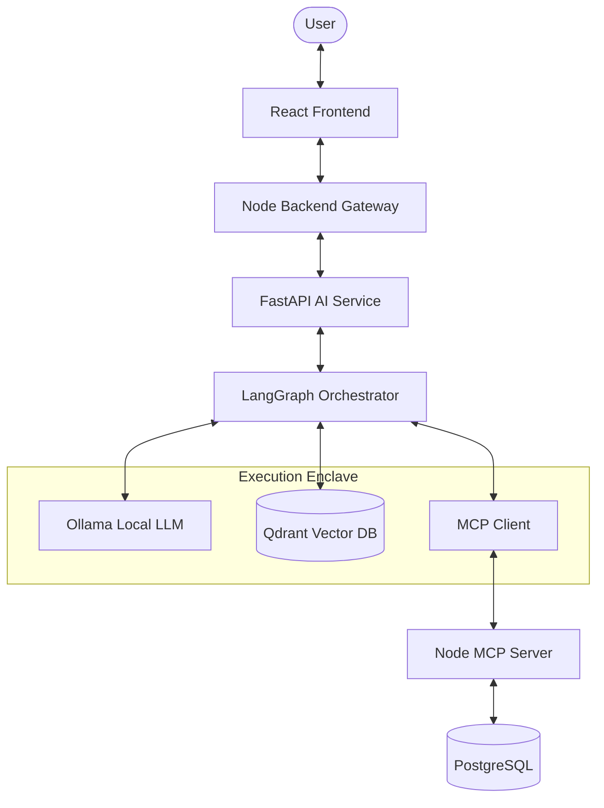
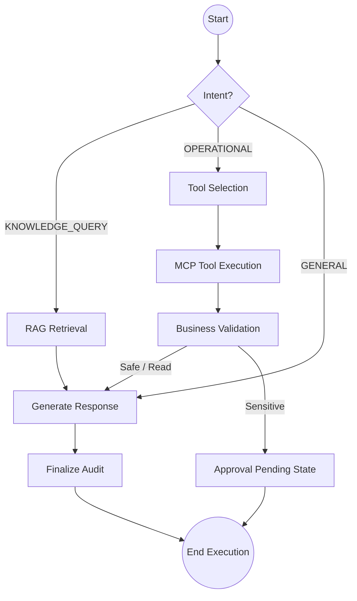
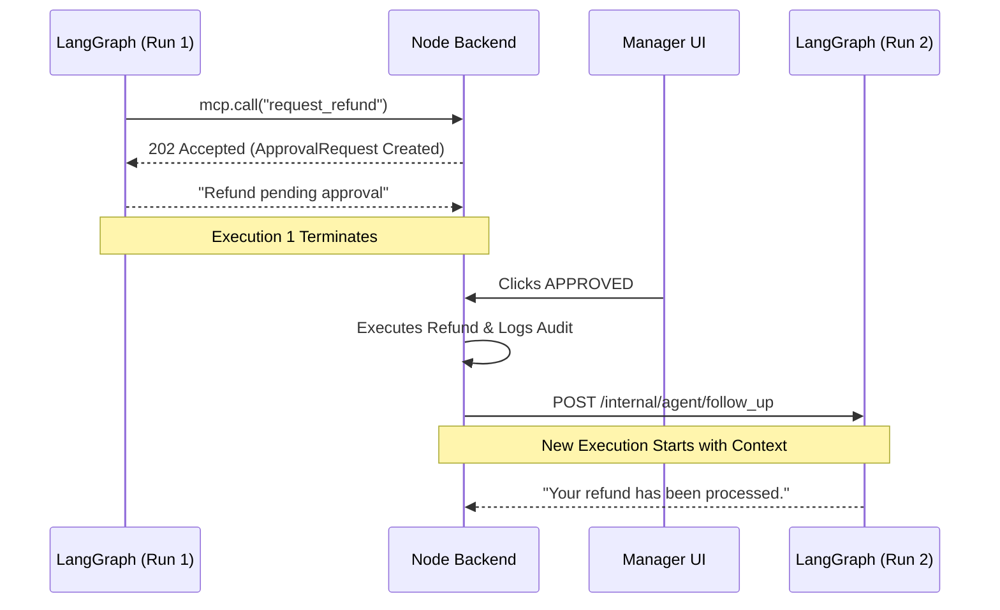

# AI Architecture

*Status: Frozen*
*Source of Truth: docs/PROJECT_MASTER.md*

---

## 1. Purpose

This document defines the AI architecture of ShopSphere AI. It explains how AI requests flow through the system, the specific responsibilities of the LangGraph orchestration layer, the contents of the graph state, the routing logic, RAG pipelines, and MCP tool execution. It strictly outlines how sensitive actions enter human approval and how asynchronous decisions trigger new agent invocations.

Crucially, this architecture ensures that AI behavior remains strictly constrained by Node.js business rules. **Hidden chain-of-thought is never exposed or persisted.** The architecture describes observable states, concrete decisions, actions, and transitions rather than private model reasoning.

---

## 2. Terminology

This terminology must remain consistent across the project:
- **Agent**: An AI-driven workflow/orchestration capability using an LLM, explicit state, tools, and rules.
- **LangGraph**: The orchestration framework/state graph.
- **LLM**: The language model used for interpretation, structured decisions, and response generation.
- **Tool**: A bounded capability exposed to the agent.
- **MCP**: The standardized protocol/interface used for business tool access.
- **RAG**: The retrieval architecture for grounding responses in company knowledge.
- **Node Business Service**: The authoritative implementation of business rules and operations.

---

## 3. Core AI Architecture Principle

The responsibilities of the underlying technologies are rigidly defined:

- **LangGraph**: Orchestrates agent execution, manages explicit graph state, controls transitions between AI workflow steps, and handles tool calls, conditional routing, and approval-related state transitions. *Does NOT own persistent business data.*
- **LLM / Ollama**: Interprets user requests, produces structured decisions/tool requests, and generates natural-language responses. *Does NOT directly access PostgreSQL, directly mutate business data, or bypass deterministic Node business rules.*
- **LangChain**: Provides RAG/retrieval abstractions and integrates embeddings/retrievers/vector stores. *Does NOT act as a second business-logic layer.*
- **Qdrant**: Stores and retrieves vector embeddings as a rebuildable retrieval index. *Is NOT the source of truth for business data.*
- **Node / MCP**: Exposes authorized business capabilities, enforces RBAC and business rules, owns PostgreSQL, and performs or proposes business actions according to tool risk classification.

*Explicit Distinction*: 
RAG = knowledge retrieval. MCP = business capabilities. LangGraph = orchestration. LLM = language/reasoning component. Node = business authority.

---

## 4. High-Level AI Request Flow

The canonical flow of an AI request ensures that the browser never speaks directly to the AI Service, Qdrant, Ollama, or the MCP Server.

**Conceptual Path**:
User → React → Node → FastAPI → LangGraph → [model/tool/retrieval] → structured result → Node → React

---

## 5. Agent Architecture Decision

ShopSphere AI utilizes **one primary LangGraph orchestration graph** with specialized logical flows (nodes) rather than an unnecessarily large multi-agent system. 

We do NOT create separate independent agents merely for orders, payments, refunds, tickets, policies, or customers. Instead, a single orchestrated graph contains specialized capabilities for:
- Request classification/routing
- Customer support workflows
- Operations workflows
- RAG retrieval
- MCP tool execution
- Approval handling
- Response generation

*Reasoning for MVP*: A unified graph reduces latency (fewer LLM hops), simplifies state management, and avoids the "agent-to-agent" miscommunication loop. The architecture remains extensible so specialized subgraphs can be introduced later if complexity justifies them.

---

## 6. Request Classification / Routing

Incoming requests are evaluated via a structured routing decision (not arbitrary natural-language routing). The system categorizes requests into intents:

- `KNOWLEDGE_QUERY`: "What is our refund policy?" (Routes to RAG)
- `OPERATIONAL_LOOKUP`: "Where is order ORD-123?" (Routes to MCP `get_order`)
- `MIXED_QUERY`: "Can I get a refund for order ORD-123?" (Routes to RAG + MCP validation)
- `SAFE_ACTION`: "Create a ticket for my delayed shipment." (Routes to MCP `create_ticket`)
- `SENSITIVE_ACTION`: "Cancel my order." (Routes to MCP `cancel_order` → ApprovalRequest)
- `OPERATIONS_TASK`: "Find all high-priority unresolved tickets." (Routes to MCP `search_tickets`)
- `GENERAL_CONVERSATION`: Small talk, basic greetings.

---

## 7. LangGraph State

The conceptual graph state is **TRANSIENT AGENT EXECUTION STATE**. It is distinct from PERSISTENT BUSINESS STATE. It does NOT store hidden chain-of-thought and is not the system of record.

**Graph State Contents**:
- `request_id` / `correlation_id`
- `conversation_id`
- `principal_context` (User vs Customer context)
- `user_message`
- `normalized_intent`
- `relevant_entities` (Extracted IDs)
- `retrieved_knowledge` (RAG chunks)
- `tool_calls` & `tool_results`
- `current_action`
- `approval_reference` (If pending)
- `business_result`
- `response_content`
- `error_state`
- `execution_status`

---

## 8. Graph Node Responsibilities

1. **Input / Normalize**: Receives the raw request, injects principal context. No LLM.
2. **Route**: LLM structured classification to determine intent. Outputs a strict enum.
3. **RAG Retrieval**: Queries Qdrant based on query strings. No LLM. Retrieves knowledge.
4. **Business Tool Selection**: LLM decides which MCP tool to call based on intent and context.
5. **MCP Tool Execution**: Executes the tool call via MCP Client. No LLM. Handles timeouts.
6. **Business Result Validation**: Validates the structure and completeness of returned business data before allowing downstream response generation. (Note: AI Service validates response structure/integrity; Node remains strictly authoritative for validating business rules and authorization). If malformed, generates an error state.
7. **Approval Gate**: Evaluates if a tool returned a `202 Accepted` (ApprovalRequest).
8. **Response Generation**: LLM generates the final natural-language response based on grounded facts.
9. **Finalization / Audit Context**: Packages the final state for the Node.js audit trail.

---

## 9. RAG Architecture

RAG is strictly for unstructured organizational knowledge (e.g., refund policies, support SOPs, escalation procedures).

**Flow**:
User query → query normalization → embedding → Qdrant similarity retrieval → optional metadata filtering → relevant chunks → LLM context → grounded response.

**Crucial Distinction**:
- RAG answers: *"What does the documented refund policy say?"*
- Node deterministic business rules answer: *"Is this specific order actually eligible?"* 
The LLM must not infer or approve eligibility based solely on retrieved policy text. Do not allow the LLM to override deterministic business rules.

---

## 10. MCP / Business Tool Architecture

The Python AI service accesses business capabilities exclusively via MCP:
**LangGraph → MCP Client → Node MCP Server → Node Business Service → Repository → PostgreSQL**

Tools are grouped by risk (per `API_CONTRACT.md`):
- **READ**: `get_customer`, `get_order`, `get_payment`, `get_shipment`, `get_ticket`, `search_tickets`, `list_tickets`.
- **SAFE WRITE**: `update_customer_contact`, `create_ticket`, `add_ticket_message`, `escalate_ticket`, `create_task`, `assign_task`.
- **SENSITIVE WRITE**: `cancel_order`, `request_refund`.

MCP is a transport interface, not an authorization system. Node remains the strict authority on business rules and RBAC. All tool inputs are validated, and outputs are sanitized before returning to the model.

---

## 11. Tool Selection and Output Validation

When the LLM proposes a tool call, the system follows a strict safety pipeline:

**LLM Output → Parse → Schema Validation → Tool-Name Validation → Argument Validation → Authorization (via Node) → Business Validation (via Node) → Execution**

- The LLM must select from the explicit MCP tool catalog. It cannot invent arbitrary operations.
- Malformed model output must fail safely. Partially parsed or ambiguous tool calls are never executed.

---

## 12. Safe vs Sensitive Actions

- **SAFE WRITE**: Executed immediately upon Node validation (e.g., `create_task`).
- **SENSITIVE WRITE**: Triggers an `ApprovalRequest`. The agent must NOT perform the sensitive transaction itself.
  - Flow: AI → MCP request → Node validation → `ApprovalRequest(PENDING)` → **Current agent execution ends.**

---

## 13. Human-In-The-Loop Flow

**Proposal Phase**:
AI proposes sensitive action → Node validates → `ApprovalRequest(PENDING)` → agent execution ends.

**Manager Decision Phase**:
Manager reviews via Node UI → clicks APPROVED or REJECTED.

**Approval Follow-up Phase**:
- Node persists the manager's decision and updates the AuditEvent.
- Node executes the exact persisted action (if APPROVED).
- Node triggers an optional **NEW** LangGraph invocation (`POST /internal/agent/follow_up`). 
- *The original LLM execution is NOT kept alive. The new execution uses persisted state to explain the outcome or alternative paths.*

---

## 14. Multi-Turn / Conversation Model

Conversation context is managed carefully by Node before passing it to FastAPI. 
- The model receives relevant previous messages, the current user message, authorized tool results, and retrieved chunks.
- The model is **never** sent: Passwords, secrets, auth tokens, raw payment cards, internal credentials, hidden chain-of-thought, or unnecessary PII.

---

## 15. LLM / Ollama Architecture

ShopSphere AI is local-first. Ollama is the required local inference provider (no paid providers). 
The LLM's sole role is to interpret requests, select from available tools, generate structured outputs, and produce user-facing responses. Deterministic validation remains entirely outside the LLM.

---

## 16. Failure Handling

The system fails closed, especially for sensitive actions. Fallback behaviors that bypass authorization or approval are forbidden.
- **Model timeout / Malformed output / Invalid arguments**: Returns a safe error response to the user.
- **Unauthorized request / Business validation failure**: Tool returns explicit rejection; Agent informs user.
- **Qdrant/RAG dependency failure**: Generates a structured internal dependency error (e.g., `QDRANT_UNAVAILABLE`). Node maps it to a stable public application-level error (e.g., `AI_UNAVAILABLE`). Detailed infrastructure information is kept in internal logs only; it is never exposed directly to the frontend. This remains consistent with `API_CONTRACT.md`.
- **Approval expired/rejected**: Notified asynchronously via a new agent invocation.

---

## 17. Agent Execution Lifecycle

**State Machine**:
`STARTED` → `ROUTING` → `RETRIEVING / TOOL_SELECTION` → `TOOL_EXECUTION` → `VALIDATION` → `APPROVAL_PENDING` (If sensitive) → `RESPONSE_GENERATION` → `COMPLETED` (or `FAILED`).

---

## 18. Observability

Observability tracks concrete transitions, NOT hidden reasoning.
**Observable artifacts**: `correlation_id`, agent run ID, graph/node transitions, explicit tool calls, sanitized tool results, latency, errors, approval transitions, and final outcomes.
**Strictly Banned**: Logging or treating internal model reasoning (chain-of-thought) as an observability requirement.

---

## 19. Security Boundary Summary

- **AI Service**: No PostgreSQL credentials, no direct database access, no direct browser exposure.
- **LLM**: No secrets, no authentication credentials, no raw payment data, no arbitrary SQL, no arbitrary tool execution.
- **Node**: Authentication authority, authorization authority, business-rule authority, approval authority.
- **MCP**: Standardized tool transport/interface (NOT an authorization mechanism).

---

## 20. Core End-to-End Examples

**A. Knowledge Question**
- *Input*: "What is our refund policy?"
- *Expected Flow*: Route → RAG (search_knowledge) → Response.

**B. Operational Lookup**
- *Input*: "Where is order ORD-123?"
- *Expected Flow*: Route → MCP (`get_order`) → Response.

**C. Sensitive Action**
- *Input*: "Refund order ORD-123."
- *Expected Flow*: Retrieve relevant policy with RAG if needed → Node checks actual order/refund eligibility via deterministic business rules → If eligible, MCP (`request_refund`) creates `ApprovalRequest(PENDING)` → Execution Ends. (If ineligible, no ApprovalRequest is created and the reason is returned). Later: Manager decision → New AI Invocation → Final response.
- *Strict Rule*: The LLM must not infer or approve eligibility based solely on retrieved policy text. It must not override deterministic business rules.

**D. Operations Automation**
- *Input*: "Find the 3 oldest high-priority unresolved tickets and create follow-up tasks."
- *Expected Flow*: Route → MCP (`search_tickets({priority: HIGH, status: OPEN, sort: oldest, limit: 3})`) → MCP (`create_task`) → MCP (`assign_task` if required) → Response.
- *Note*: The LLM must not arbitrarily determine business priority. The user-specified criteria must be represented as structured search/filter parameters where possible. Node remains the authority for authorization and business constraints.

---

## 21. Graph Diagrams

### A. LangGraph Request Flow

### B. Human Approval & Follow-Up Path

---

## 22. What We Are Not Building

The MVP explicitly does **NOT** include:
- Autonomous unrestricted agents or arbitrary SQL agents.
- Autonomous financial transactions bypassing approval.
- Unrestricted browser/tool access.
- Direct LLM database access.
- Hidden chain-of-thought storage or exposure.
- Dozens of independent agents mimicking corporate departments.
- Long-running LLM processes waiting for human approval.
- Additional agent infrastructure like Redis, Kafka, or WebSockets.

---

*End of Document*
