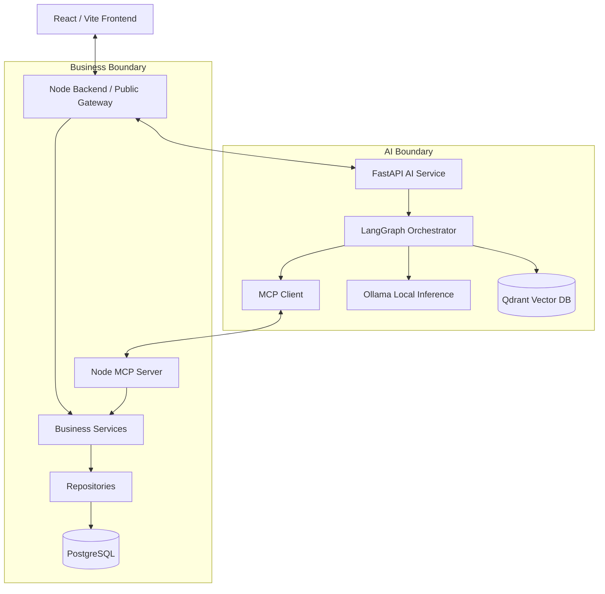
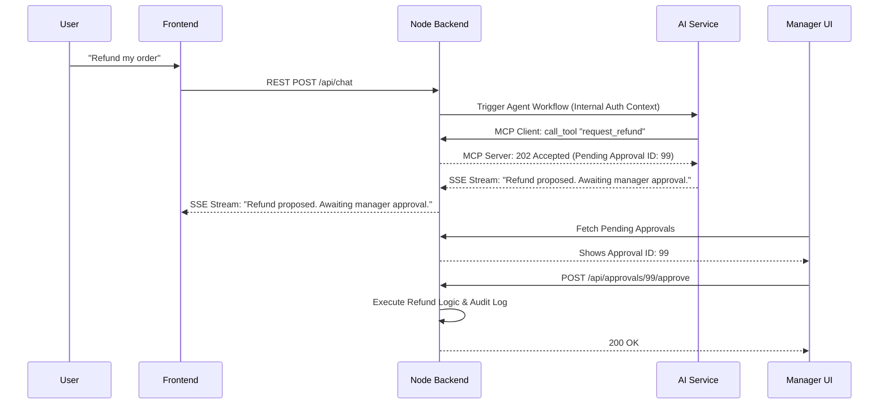

# Architecture

*Status: Frozen*
*Source of Truth: docs/PROJECT_MASTER.md*

This document defines HOW ShopSphere AI is structured and how its components communicate. It strictly enforces the data and authorization boundaries defined in `PROJECT_SPEC.md`.

---

## 1. Reference Architecture Lessons

Before finalizing our architecture, we analyzed two reference repositories to draw structural lessons.

**Reference A: `multi-agent-rag-customer-support`**
- **Learnings**: Demonstrated a clean separation of LangGraph logic (`graph.py`), state management (`state.py`), tools, and vector DB integration. It showcased specialized agents (Triage, Support) and routing logic.
- **Adopted**: We adopt the modular LangGraph agent routing approach and the distinct separation of RAG vector logic from tool execution logic.
- **Rejected**: We will NOT adopt any monolithic database access patterns where the AI service directly mutates persistent system state. 

**Reference B: `hiveops`**
- **Learnings**: Demonstrated a strong separation of frontend (`web`) and backend (`server`) logic, with a Node.js API acting as the central hub for tasks and workflows.
- **Adopted**: We adopt the Node.js backend acting as the absolute authority for data persistence, role-based access control, and task queues.
- **Rejected**: We reject deep coupling of agent logic within the Node.js service; our AI logic will be isolated in a dedicated Python FastAPI service.

---

## 2. High-Level System Architecture

ShopSphere AI enforces strict data boundaries. The Node.js Backend is the sole public gateway and the owner of persistent business data. The FastAPI AI Service acts as an ephemeral reasoning engine.



*Note: The AI Service requests business actions via the MCP Client interface connected to the Node MCP Server. The AI Service NEVER connects directly to PostgreSQL.*

---

## 3. Architectural Layers

### Frontend
- **Owns**: User interface, client-side state, user interactions.
- **Accesses**: Node API exclusively.
- **Cannot Access**: FastAPI API, PostgreSQL, Qdrant, Ollama, backend services directly.
- **Communication**: REST for normal API communication and SSE for AI streaming.

### Node API Layer (Routes & Controllers)
- **Owns**: Public application gateway, HTTP lifecycle, request validation, authentication checks.
- **Accesses**: Node Services, FastAPI AI Service.
- **Cannot Access**: Repositories directly.

### Node Services
- **Owns**: Core business logic, workflow execution, authorization rules, task management.
- **Accesses**: Node Repositories.
- **Cannot Access**: Direct SQL queries (must use repositories).

### Node Repositories & PostgreSQL
- **Owns**: Data persistence, schema queries, transactions.
- **Accesses**: PostgreSQL database.
- **Cannot Access**: External APIs.

### FastAPI API Layer
- **Owns**: Exposing agent capabilities to the Node Backend, streaming AI responses via SSE.
- **Accesses**: LangGraph orchestration.
- **Cannot Access**: Node Repositories, PostgreSQL, Frontend.

### AI Orchestration (LangGraph)
- **Owns**: State-machine execution of agent reasoning loops, routing, tool invocation.
- **Accesses**: Agents, MCP Client, RAG, Ollama.

### Agents & RAG
- **Owns**: Prompt construction, decision logic, vector retrieval pipelines.
- **Accesses**: Qdrant, local documents.

### Tools & MCP
- **Owns**: The definitions and schemas for executing business actions.
- **Accesses**: MCP Client accesses the Node MCP Server.
- **Cannot Access**: PostgreSQL directly. No duplicate implementations of business capabilities should reside inside Python.

---

## 4. Node Backend Architecture

Canonical structure for `backend/src/`:

- `config/`: Environment variables, logger configuration, DB connection strings.
- `middleware/`: Auth guards, error handlers, rate limiting.
- `routes/`: Express route definitions mapping URLs to controllers.
- `controllers/`: HTTP request/response parsing and formatting.
- `services/`: Canonical business logic and rules.
- `repositories/`: Database queries and data access objects.
- `models/`: Database schemas, ORM models, or type definitions representing DB entities.
- `validators/`: Input validation schemas (e.g., Zod, Joi).
- `utils/`: Truly generic utilities (e.g., date formatting).

**Forbidden Directories**: `service/`, `managers/`, `use-cases/`, `adapters/`, `handlers/`, `providers/`. There must be exactly ONE canonical `services/` directory.

---

## 5. AI Service Architecture

Canonical structure for `ai-service/app/`:

- `api/`: FastAPI endpoint definitions accessed exclusively by Node Backend.
- `agents/`: LangGraph definitions, specialized agents (Support, Operations).
- `rag/`: Document loaders, chunkers, embeddings, Qdrant client interfaces.
- `tools/`: MCP Client wrappers where technically required; these must not duplicate business logic.
- `mcp/`: MCP Client configuration and execution context.
- `models/`: LLM provider abstractions (defaulting to Ollama).
- `services/`: AI-specific logic that doesn't fit into a single agent or wrapper.
- `schemas/`: Pydantic models for request/response validation.
- `config/`: Environment configuration.
- `utils/`: Helper functions.

---

## 6. Node ↔ FastAPI Communication

- **Request Flow**: 
  - *Sync*: Node.js triggers a FastAPI endpoint and awaits a structured response.
  - *Async/Stream*: Node.js opens an SSE stream to FastAPI and relays the AI stream directly back to the React frontend. WebSockets are explicitly not used.
- **Authentication Context**: 
  - React authenticates exclusively through Node.
  - Node establishes the authenticated user context.
  - FastAPI receives trusted user/request context through authenticated internal communication from Node.
  - Business authorization is ultimately enforced by Node. (Security-specific token mechanics are deferred to `SECURITY.md`).
- **Error Handling**: FastAPI wraps LLM failures in standard HTTP 5xx or 4xx responses. If FastAPI is unavailable, the Node API must fail gracefully, alerting the user that AI features are degraded.
- **Correlation**: `X-Request-ID` is generated at the public Node gateway and propagated across both services for trace logging.

---

## 7. AI Tool Architecture

Agent → Tool execution flow:

1. **Agent** decides to call a tool (e.g., `request_refund`).
2. **MCP Client** (Python) executes the call via the standardized interface.
3. **Node MCP Server** receives the invocation alongside the trusted authorization context.
4. **Node Backend** authorizes the action based on the user's role.
5. **Node Service** processes the business logic.
6. **Sensitive Write**: If the action requires approval, the Node Service writes an "Approval Request" to PostgreSQL and returns a `202 Accepted (Pending Approval)` status.
7. **MCP Server** returns the status to the MCP Client.
8. **Agent** informs the user.

- **READ tools**: Fetch data securely (e.g., `get_order`).
- **SAFE WRITE tools**: Mutate low-risk data (e.g., `create_task`).
- **SENSITIVE WRITE tools**: Mutate high-risk data (e.g., `request_refund`), requiring human-in-the-loop approval.

---

## 8. MCP Architecture

- **Role**: MCP serves strictly as a standardized tool interface boundary. It exposes the Node.js business capabilities to the AI Service. The Node-hosted MCP Server is an internal service interface used exclusively by trusted AI clients. It must NOT be exposed as an unauthenticated public API or directly exposed to the browser.
- **Conceptual Boundary**:
  FastAPI / MCP Client → Internal MCP interface → Node MCP Server → Node Business Services → PostgreSQL
- **Location**: The Node backend owns the business capabilities and hosts the **MCP Server**. The Python AI service acts as an **MCP Client**.
- **Not Responsible For**: MCP is NOT an authorization mechanism.
- **No Duplication**: The Python AI Service must not duplicate every business capability. It relies on the Node MCP Server to perform the actual business logic.

---

## 9. RAG Architecture

1. **Ingestion**: Raw documents (PDF, Markdown) loaded from disk.
2. **Cleaning & Chunking**: Semantic splitting of texts into manageable blocks.
3. **Embeddings**: Local embedding model translates text chunks into vectors.
4. **Qdrant**: Stores vectors and associated metadata (e.g., document type, department).
5. **Retrieval**: User query is embedded; Qdrant performs a cosine-similarity search with metadata filtering.
6. **Context Construction**: Chunks are aggressively filtered and formatted into the LLM prompt.
7. **LLM**: For knowledge-based responses, the LLM grounds its answer on retrieved authoritative chunks. Operational facts are obtained through authorized business tools.

---

## 10. Agent Architecture

- **Support Agent**: Specialized in resolving customer queries, invoking RAG for policies, and looking up user orders via MCP.
- **Operations Agent**: Small, focused agent for internal staff. Inspects operational data, creates tasks, assigns tickets, and interacts with workflows via MCP.
- **Routing**: A lightweight Triage node determines the intent of the incoming query and routes execution to the appropriate specialized agent. Agents do not share working memory, but they share the same underlying conversation state schema in LangGraph.

---

## 11. Human-in-the-Loop Architecture

1. **Agent** proposes sensitive action via MCP Client.
2. **Node MCP Server & Services** intercept and create an `ApprovalRequest` record in PostgreSQL. State is Persistent.
3. **Agent** halts execution for this specific tool path and streams a notification back to Node.
4. **Manager UI** fetches the pending request via the Node Backend. Manager clicks "Approve".
5. **Node Backend** executes the actual financial/business logic and updates the audit log.
6. **Result**: The ticket is updated. The LLM is NOT kept alive in memory waiting for the human.

---

## 12. Workflow Architecture

- **Deterministic Workflows**: Node.js owns scheduled jobs, event triggers (e.g., ticket created), and rigid if/then/else business rules.
- **Agentic Reasoning**: Python owns natural language understanding, ambiguous policy interpretation, and dynamic tool selection.
- **Boundary**: Node.js handles the "When X happens, do Y" engine. If "Y" requires AI analysis, Node.js triggers a discrete FastAPI call.

---

## 13. Audit Architecture

The system maintains an **append-only** audit log in PostgreSQL.
It captures:
- Request ID, Timestamp, User, Agent Name
- Tool called, sanitized inputs, result summary
- Retrieved RAG source references
- Final decision/action and Approval status
- Latency and Errors
- The UI exposes "agent actions and decision rationale", NOT hidden agent reasoning.

---

## 14. Failure Boundaries

- **Ollama Unavailable**: AI Service returns HTTP 503. UI shows "AI Assistant offline."
- **Qdrant Unavailable**: RAG tools fail gracefully. Agent responds: "I cannot access the knowledge base right now."
- **FastAPI Unavailable**: Node API fails gracefully, alerting the user that AI features are degraded.
- **Node API Unavailable**: Public gateway is down. Total system outage.
- **Approval Expires**: Node.js cron job marks request as expired. Customer is notified via ticket update.

---

## 15. Security Boundaries

- **Authentication**: JWT generated by Node.js.
- **Authorization**: Role checks inside Node.js services.
- **Context Propagation**: React authenticates through Node; Node passes trusted context to FastAPI.
- **Audit Protection**: Node.js repository layer prevents `UPDATE` or `DELETE` on the `audit_logs` table.

---

## 16. Project Directory Architecture

```text
shopsphere-ai/
├── .agents/
├── docs/
├── frontend/
│   └── src/
│       ├── components/
│       ├── pages/
│       ├── layouts/
│       ├── hooks/
│       ├── services/
│       ├── context/
│       ├── utils/
│       └── assets/
├── backend/
│   └── src/
│       ├── config/
│       ├── middleware/
│       ├── routes/
│       ├── controllers/
│       ├── services/
│       ├── repositories/
│       ├── models/
│       ├── validators/
│       └── utils/
├── ai-service/
│   └── app/
│       ├── api/
│       ├── agents/
│       ├── rag/
│       ├── tools/
│       ├── mcp/
│       ├── models/
│       ├── services/
│       ├── schemas/
│       ├── config/
│       └── utils/
├── data/
│   ├── documents/
│   └── seed/
├── scripts/
├── tests/
├── docker-compose.yml
└── README.md
```

---

## 17. Data Ownership Matrix

| Component | Owns (Source of Truth) | Reads | Writes |
| :--- | :--- | :--- | :--- |
| **Node Backend** | Business Logic, PostgreSQL schema, Auth, Workflows | PostgreSQL, AI APIs | PostgreSQL, AI APIs |
| **PostgreSQL** | Persistent application data (Orders, Users, Tasks, Logs) | N/A | N/A |
| **AI Service** | AI Orchestration, Prompts, RAG Logic, Agent State | Qdrant, Node MCP | Qdrant, Node MCP |
| **Qdrant** | Vector index and embedding storage* | N/A | N/A |
| **Frontend** | Client-side UI State | Node APIs | Node APIs |

*\* Note on Qdrant: The true source-of-truth knowledge documents remain in the project's document storage (`data/documents/`). Qdrant serves as a disposable index that can be rebuilt from those documents at any time.*

---

## 18. Request Flow Diagrams

**Refund with Human Approval Flow**


---

## 19. Architectural Trade-offs

- **Why Node is the public gateway**: Enforces authentication, authorization, and rate-limiting at a single secure edge. Prevents frontend from directly invoking unprotected backend AI endpoints.
- **Why MCP Server belongs with the business capability boundary**: Node.js physically owns the database, logic, and authorization schemas. Hosting the MCP server here ensures that tool execution inherently respects business rules without needing parallel logic in Python.
- **Why Python uses MCP as a client**: Allows LangGraph to cleanly interoperate with a standardized protocol. Prevents duplicate tool implementations and keeps the AI Service completely ignorant of PostgreSQL schemas.
- **Why Node owns PostgreSQL**: Security and data integrity. Enforcing RBAC in one place prevents AI-generated code or rogue agents from issuing destructive SQL queries.
- **Why Python is separated**: Python has the most robust ecosystem for AI (LangGraph, Qdrant client, local embeddings). Node.js handles standard web serving better.
- **Why Human Approval state is persistent**: LLM processes are ephemeral and can crash/timeout. Waiting hours for a human manager inside a Python thread is an anti-pattern.

---

## 20. Architectural Anti-patterns

The following are strictly forbidden in this codebase:
- ❌ **React → FastAPI Direct Access**: The UI must proxy all requests through the Node Backend.
- ❌ **Python → PostgreSQL**: The AI service directly connecting to the SQL database.
- ❌ **Duplicate Tool Logic**: The Python AI Service implementing independent business tool logic instead of wrapping the MCP interface.
- ❌ **LLM → Direct Mutation**: Allowing the LLM to execute code that mutates state without going through a strictly typed, authenticated Node.js tool.
- ❌ **MCP → Bypass Authorization**: Using MCP to bypass the role checks inside the Node.js controllers.
- ❌ **Duplicate Services**: Creating `backend/src/use-cases/` or `backend/src/managers/`.
- ❌ **Route → Business Logic**: Placing heavy logic inside Express routing files instead of `services/`.
