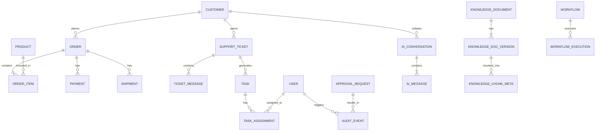

# Data Model

*Status: Frozen*
*Source of Truth: docs/PROJECT_MASTER.md*

This document defines the conceptual and relational data model of ShopSphere AI. It specifies business entities, their relationships, and strict data access boundaries, adhering completely to `PROJECT_SPEC.md` and the frozen `ARCHITECTURE.md`.

---

## 1. Data Model Principles

- PostgreSQL is the persistent source of truth for business/application data.
- Node.js owns PostgreSQL access.
- AI Service never directly accesses PostgreSQL.
- Business entities are normalized enough to avoid unnecessary duplication.
- Relationships must support realistic customer-support and operations scenarios.
- Sensitive operations must have persistent approval state.
- Audit records are append-only.
- Knowledge documents are separate from operational business data.
- Qdrant stores a rebuildable vector index, not the source-of-truth documents.
- AI/agent execution state must be distinguished from persistent business state.
- Premature optimization and enterprise-scale distributed system designs are explicitly avoided.

---

## 2. Domain Overview

The ShopSphere business domain consists of the following conceptual entities:

**Identity & Access**
- User (System accounts for Admins, Managers, Operations, Agents)
- Role

**Customer Domain**
- Customer (External end-users)
- CustomerAddress

**Catalog Domain**
- Product
- ProductCategory

**Order Domain**
- Order
- OrderItem

**Payment Domain**
- Payment

**Fulfillment Domain**
- Shipment

**Support Domain**
- SupportTicket
- TicketMessage

**Operations Domain**
- Task
- TaskAssignment

**Approval Domain**
- ApprovalRequest

**Workflow Domain**
- Workflow
- WorkflowExecution

**Audit Domain**
- AuditEvent

**Knowledge Domain**
- KnowledgeDocument
- KnowledgeDocumentVersion
- KnowledgeChunkMetadata

**AI/Conversation Domain**
- AIConversation
- AIMessage
- AgentRun

*(Note: No unnecessary entities have been added. This strictly models the required functional scope.)*

---

## 3. Entity-by-Entity Specification

### Identity & Access
**User**
- **Purpose**: Represents internal authenticated staff members (Admins, Managers, Operations, etc.). Explicitly distinct from external customers.
- **Primary ID**: UUID
- **Important attributes**: `email`, `password_hash`, `role_id`, `active`
- **Required/optional attributes**: All required except `password_hash` if SSO is used.
- **Relationships**: Belongs to a Role. Has many TaskAssignments. Has many AuditEvents.
- **Lifecycle/status**: active (boolean).
- **Access**: Created/Updated by Admin. Read by Admin/Operations. 
- **AI Access**: NO DIRECT ACCESS.
- **Important constraints**: Email must be unique. The internal staff User entity is separate from the Customer entity.

**Role**
- **Purpose**: RBAC definition for internal staff.
- **Primary ID**: UUID
- **Important attributes**: `name`
- **Required/optional attributes**: `name` (required).
- **Relationships**: Has many Users.
- **Lifecycle/status**: N/A.
- **Access**: System/Admin managed.
- **AI Access**: NO DIRECT ACCESS.
- **Important constraints**: Do not add CUSTOMER to this enum. Customers are represented by a separate entity.

### Customer Domain
**Customer**
- **Purpose**: Represents an external end-user/buyer (the CUSTOMER persona from PROJECT_SPEC.md).
- **Primary ID**: UUID
- **Important attributes**: `first_name`, `last_name`, `email`, `phone`
- **Required/optional attributes**: `first_name`, `last_name`, `email` (required), `phone` (optional).
- **Relationships**: Has many Orders, SupportTickets, AIConversations, CustomerAddresses.
- **Lifecycle/status**: Soft-deleted flag.
- **Access**: Read by Support/AI. Updated by Customer/Support.
- **AI Access**: READ ONLY (via `get_customer`). SAFE WRITE (via `update_customer_contact`).
- **Important constraints**: Must be kept distinct from internal Users.

**CustomerAddress**
- **Purpose**: Represents shipping/billing addresses for customers.
- **Primary ID**: UUID
- **Important attributes**: `street`, `city`, `zip`, `country`
- **Required/optional attributes**: `customer_id`, `street`, `city`, `zip` (all required).
- **Relationships**: Belongs to Customer.
- **Lifecycle/status**: Active or soft-deleted.
- **Access**: Read by Support/AI.
- **AI Access**: READ ONLY.
- **Important constraints**: Multiple addresses per customer allowed.

### Catalog Domain
**Product**
- **Purpose**: Represents an item for sale in the catalog.
- **Primary ID**: UUID (internal primary key)
- **Important attributes**: `sku` (business identifier), `name`, `description`, `price`, `stock_quantity`
- **Required/optional attributes**: `sku`, `name`, `price`, `category_id` (required).
- **Relationships**: Belongs to ProductCategory, included in OrderItems.
- **Lifecycle/status**: Active or inactive.
- **Access**: Read globally. Update by internal staff.
- **AI Access**: READ ONLY.
- **Important constraints**: SKU must be a unique string, but must not be the database primary key.

**ProductCategory**
- **Purpose**: Categorization of products.
- **Primary ID**: UUID
- **Important attributes**: `name`, `description`
- **Required/optional attributes**: `name` (required).
- **Relationships**: Has many Products.
- **Lifecycle/status**: Active or inactive.
- **Access**: Read globally.
- **AI Access**: READ ONLY.
- **Important constraints**: Name must be unique.

### Order Domain
**Order**
- **Purpose**: Represents a customer's purchase.
- **Primary ID**: UUID (Internal), Business ID (e.g., ORD-100293)
- **Important attributes**: `total_amount`, `status`, `created_at`
- **Required/optional attributes**: `customer_id`, `total_amount`, `status` (required).
- **Relationships**: Belongs to Customer. Has many OrderItems, Payments, Shipments.
- **Lifecycle/status**: status (enum).
- **Access**: Read by Customer, Node, Auth Users.
- **AI Access**: READ ONLY (via `get_order`). SENSITIVE WRITE (via `cancel_order`).
- **Important constraints**: Must enforce status transitions.

**OrderItem**
- **Purpose**: Line items within an order.
- **Primary ID**: UUID
- **Important attributes**: `quantity`, `unit_price`
- **Required/optional attributes**: `order_id`, `product_id`, `quantity`, `unit_price` (required).
- **Relationships**: Belongs to Order and Product.
- **Lifecycle/status**: Follows Order lifecycle.
- **Access**: Read by Customer, Node.
- **AI Access**: READ ONLY.
- **Important constraints**: `unit_price` captures the price at the time of purchase.

### Payment Domain
**Payment**
- **Purpose**: Records a payment transaction attempt against an order.
- **Primary ID**: UUID
- **Important attributes**: `amount`, `status`, `gateway_reference`
- **Required/optional attributes**: `order_id`, `amount`, `status` (required), `gateway_reference` (optional/required upon completion).
- **Relationships**: Belongs to Order. (Order 1 → N Payment).
- **Lifecycle/status**: status (enum).
- **Access**: Read by Node, Managers.
- **AI Access**: READ ONLY (via `get_payment`). SENSITIVE WRITE (via `request_refund`).
- **Important constraints**: Multiple payment attempts per order are permitted.

### Fulfillment Domain
**Shipment**
- **Purpose**: Records physical fulfillment of an order.
- **Primary ID**: UUID
- **Important attributes**: `carrier`, `tracking_number`, `status`, `estimated_delivery`
- **Required/optional attributes**: `order_id`, `status` (required), `carrier`, `tracking_number` (optional until shipped).
- **Relationships**: Belongs to Order. (Order 1 → N Shipment).
- **Lifecycle/status**: status (enum).
- **Access**: Read by Node, Auth Users.
- **AI Access**: READ ONLY (via `get_shipment`).
- **Important constraints**: Multiple shipments per order are permitted (split fulfillment).

### Support Domain
**SupportTicket**
- **Purpose**: Tracks external customer issues and inquiries.
- **Primary ID**: UUID, Business ID (TKT-83921)
- **Important attributes**: `subject`, `category`, `priority`, `status`
- **Required/optional attributes**: `customer_id`, `subject`, `status` (required), `order_id`, `assigned_user_id` (optional).
- **Relationships**: Belongs to Customer. Optional links to Order, User. Has many TicketMessages, Tasks.
- **Lifecycle/status**: status (enum).
- **Access**: Node, Auth Users.
- **AI Access**: READ (via `get_ticket`, `search_tickets`, `list_tickets`). SAFE WRITE (via `create_ticket`, `add_ticket_message`, `escalate_ticket`).
- **Important constraints**: Operations Agent must be able to search and filter tickets.

**TicketMessage**
- **Purpose**: Messages within a support ticket.
- **Primary ID**: UUID
- **Important attributes**: `sender_type`, `content`, `created_at`
- **Required/optional attributes**: `ticket_id`, `sender_type`, `content` (required).
- **Relationships**: Belongs to SupportTicket.
- **Lifecycle/status**: Append-only.
- **Access**: Node, Auth Users.
- **AI Access**: SAFE WRITE.
- **Important constraints**: Must clearly distinguish between CUSTOMER, AGENT, and AI messages.

### Operations Domain
**Task**
- **Purpose**: Tracks internal operations work.
- **Primary ID**: UUID, Business ID (TSK-5512)
- **Important attributes**: `title`, `description`, `priority`, `status`, `creator_type`
- **Required/optional attributes**: `title`, `status`, `creator_type` (required), `related_entity_type`, `related_entity_id` (optional).
- **Relationships**: Has many TaskAssignments. Optional link to SupportTicket/other entities.
- **Lifecycle/status**: status (enum).
- **Access**: Node, Staff.
- **AI Access**: SAFE WRITE (via `create_task`).
- **Important constraints**: Can be created by AI (Operations Agent) or internal staff.

**TaskAssignment**
- **Purpose**: Links a Task to the User(s) responsible for executing it.
- **Primary ID**: UUID
- **Important attributes**: `assigned_at`, `unassigned_at`, `active_flag`
- **Required/optional attributes**: `task_id`, `user_id`, `assigned_at` (required), `unassigned_at` (optional).
- **Relationships**: Belongs to Task and User.
- **Lifecycle/status**: Active/Inactive based on unassigned_at/active_flag.
- **Access**: Node, Staff.
- **AI Access**: SAFE WRITE (Operations Agent can assign/reassign tasks through authorized tools).
- **Important constraints**: Allows tracking of assignment history.

### Approval Domain
**ApprovalRequest**
- **Purpose**: Bridges AI decision making and real-world execution for sensitive actions.
- **Primary ID**: UUID
- **Important attributes**: `requested_action`, `requesting_user_id`, `requesting_actor_type`, `target_entity_type`, `target_entity_id`, `risk_level`, `decision_rationale`, `status`, `reviewer_id`, `created_at`, `reviewed_at`, `expiration_timestamp`, `rejection_reason`, `execution_result_summary`
- **Required/optional attributes**: `requested_action`, `requesting_actor_type`, `target_entity_type`, `target_entity_id`, `status` (required). Others optional based on state.
- **Relationships**: Has many AuditEvents (1 → N). Optional link to requesting User and reviewing User.
- **Lifecycle/status**: status (enum: PENDING, APPROVED, REJECTED, EXPIRED, EXECUTED, FAILED).
- **Access**: Read by Node, Managers.
- **AI Access**: READ ONLY (to check status).
- **Important constraints**: `requesting_actor_type` explicitly tracks source (USER, AI, SYSTEM). Preserve user context (`requesting_user_id`) to know which user the AI was acting on behalf of.

### Workflow Domain
**Workflow**
- **Purpose**: Defines an automated business process or orchestration sequence.
- **Primary ID**: UUID
- **Important attributes**: `name`, `description`, `status`
- **Required/optional attributes**: `name`, `status` (required).
- **Relationships**: Has many WorkflowExecutions.
- **Lifecycle/status**: status (enum: ACTIVE, DEPRECATED).
- **Access**: Node backend.
- **AI Access**: NO DIRECT ACCESS.
- **Important constraints**: Deterministic workflow state owned by Node/PostgreSQL. Not dependent on an LLM remaining alive.

**WorkflowExecution**
- **Purpose**: Represents an execution instance of a Workflow.
- **Primary ID**: UUID
- **Important attributes**: `status`, `started_at`, `completed_at`, `execution_log`
- **Required/optional attributes**: `workflow_id`, `status`, `started_at` (required).
- **Relationships**: Belongs to Workflow.
- **Lifecycle/status**: status (enum).
- **Access**: Node backend.
- **AI Access**: NO DIRECT ACCESS.
- **Important constraints**: Owned by Node/PostgreSQL.

### Audit Domain
**AuditEvent**
- **Purpose**: Immutable log of system actions and executions.
- **Primary ID**: UUID
- **Important attributes**: `request_id`, `actor_type`, `actor_id`, `action`, `entity_type`, `entity_id`, `sanitized_input`, `result_summary`, `timestamp`
- **Required/optional attributes**: `actor_type`, `action`, `timestamp` (required). `approval_request_id` (optional).
- **Relationships**: Optionally belongs to ApprovalRequest, User, etc.
- **Lifecycle/status**: Append-only.
- **Access**: Node, Admins.
- **AI Access**: NO DIRECT ACCESS.
- **Important constraints**: An ApprovalRequest can produce multiple AuditEvents.

### Knowledge Domain
**KnowledgeDocument**
- **Purpose**: Represents a managed piece of business knowledge (e.g., Refund Policy).
- **Primary ID**: UUID
- **Important attributes**: `title`, `document_type`, `department`, `status`
- **Required/optional attributes**: `title`, `status` (required).
- **Relationships**: Has many KnowledgeDocumentVersions.
- **Lifecycle/status**: status (enum: DRAFT, PUBLISHED, ARCHIVED).
- **Access**: Node.
- **AI Access**: READ ONLY (metadata via tools).
- **Important constraints**: Source documents stored in `data/documents/`, PostgreSQL only stores metadata.

**KnowledgeDocumentVersion**
- **Purpose**: A specific revision of a KnowledgeDocument.
- **Primary ID**: UUID
- **Important attributes**: `version_number`, `content_hash`, `effective_date`, `expiration_date`, `status`, `source_path`, `created_at`
- **Required/optional attributes**: `document_id`, `version_number`, `content_hash`, `effective_date`, `status`, `source_path` (required).
- **Relationships**: Belongs to KnowledgeDocument. Has many KnowledgeChunkMetadata.
- **Lifecycle/status**: status (enum).
- **Access**: Node.
- **AI Access**: READ ONLY.
- **Important constraints**: Do not duplicate full document content unnecessarily in DB.

**KnowledgeChunkMetadata**
- **Purpose**: Tracks vector chunks back to their source version.
- **Primary ID**: UUID
- **Important attributes**: `chunk_index`, `qdrant_point_id`
- **Required/optional attributes**: `version_id`, `chunk_index`, `qdrant_point_id` (required).
- **Relationships**: Belongs to KnowledgeDocumentVersion.
- **Lifecycle/status**: N/A.
- **Access**: Node.
- **AI Access**: READ ONLY (via authorized knowledge/retrieval interfaces, not direct PostgreSQL access).
- **Important constraints**: Qdrant stores the rebuildable vector index.

### AI Conversation Domain
**AIConversation**
- **Purpose**: Groups a series of AI messages in a single session/thread.
- **Primary ID**: UUID
- **Important attributes**: `started_at`, `status`
- **Required/optional attributes**: `customer_id` (optional, if anonymous), `started_at`, `status` (required).
- **Relationships**: Has many AIMessages.
- **Lifecycle/status**: status (enum).
- **Access**: Node, AI Service.
- **AI Access**: READ/WRITE (via authorized Node interfaces only).
- **Important constraints**: Retained based on configurable policy.

**AIMessage**
- **Purpose**: Individual utterance within an AI Conversation.
- **Primary ID**: UUID
- **Important attributes**: `role`, `content`
- **Required/optional attributes**: `conversation_id`, `role`, `content` (required).
- **Relationships**: Belongs to AIConversation.
- **Lifecycle/status**: Append-only.
- **Access**: Node, AI Service.
- **AI Access**: READ/WRITE (via authorized Node interfaces only).
- **Important constraints**: N/A.

**AgentRun**
- **Purpose**: Conceptual transient execution record of an agent's LangGraph state machine execution.
- **Primary ID**: UUID (transient/ephemeral)
- **Important attributes**: `agent_name`, `status`, `started_at`
- **Required/optional attributes**: N/A
- **Relationships**: Associated with AIConversation.
- **Lifecycle/status**: status (enum: RUNNING, SUCCESS, FAILED).
- **Access**: AI Service (Internal).
- **AI Access**: INTERNAL ONLY.
- **Important constraints**: Agent execution state is transient LangGraph state held in memory during execution. Does not exist as a persistent table in PostgreSQL. If execution metadata needs persistence, only a summarized record may be persisted through the Node/PostgreSQL boundary (e.g., via AuditEvent). Do not introduce SQLite or other databases.

---

## 4. ID Strategy

The system uses a **hybrid identifier strategy**:

- **Internal Primary Keys**: `UUID` v4. Used exclusively for foreign key relationships and API payloads. Guarantees global uniqueness and prevents ID enumeration attacks (e.g., guessing order IDs).
- **Business Identifiers**: Human-readable prefixed strings (e.g., `ORD-100293`, `TKT-83921`, `TSK-1102`). Generated sequentially or via short hashes, used in the UI, customer emails, and AI conversations to allow users to easily reference entities.

---

## 5. Core Relationships

- Customer 1 ──── N Order
- Order 1 ──── N OrderItem
- Order 1 ──── N Payment
- Order 1 ──── N Shipment
- Customer 1 ──── N SupportTicket
- SupportTicket 1 ──── N TicketMessage
- SupportTicket 1 ──── N Task (Optional, operational follow-ups)
- Task 1 ──── N TaskAssignment
- TaskAssignment N ──── 1 User
- ApprovalRequest 1 ──── N AuditEvent (Execution log)
- User 1 ──── N AuditEvent
- KnowledgeDocument 1 ──── N KnowledgeDocumentVersion
- KnowledgeDocumentVersion 1 ──── N KnowledgeChunkMetadata
- AIConversation 1 ──── N AIMessage
- Workflow 1 ──── N WorkflowExecution

---

## 6. Order / Payment / Shipment Model

Order, Payment, and Shipment statuses are intentionally decoupled to support realistic e-commerce scenarios and complex support queries.

- **Order Statuses**: PENDING, CONFIRMED, PROCESSING, SHIPPED, DELIVERED, CANCELLED, RETURN_REQUESTED, REFUNDED.
- **Payment Statuses**: PENDING, COMPLETED, FAILED, REFUNDED.
- **Shipment Statuses**: PREPARING, IN_TRANSIT, OUT_FOR_DELIVERY, DELIVERED, EXCEPTION.

**Scenarios Supported:**
- *"Where is my order?"* → Joins Order and Shipment tables.
- *"Was I charged?"* → Inspects Payment table (Status: FAILED vs COMPLETED).
- *"Can I cancel?"* → Checks Shipment status (cannot cancel if IN_TRANSIT).

---

## 7. Support Ticket Model

Tickets track external customer issues. 
- **Categories**: ORDER_ISSUE, PAYMENT_ISSUE, SHIPPING_DELAY, PRODUCT_INQUIRY, POLICY_QUESTION.
- **Statuses**: OPEN, IN_PROGRESS, WAITING_ON_CUSTOMER, ESCALATED, RESOLVED, CLOSED.
- **Priorities**: LOW, MEDIUM, HIGH, URGENT.

The AI Agent can read tickets, add messages, or change the status to ESCALATED if it cannot resolve the issue.

---

## 8. Task / Operations Model

Tasks track internal operations work.
- **Statuses**: TODO, IN_PROGRESS, BLOCKED, DONE.
- **Source**: Distinguished by the `creator_type` (USER vs SYSTEM vs AI).
- **Usage**: If an AI Operations Agent detects 3 stale tickets, it creates 3 Tasks and assigns them to the Support Manager. Tasks are independent of tickets but link via `related_entity_id`.

---

## 9. Approval Model

The `ApprovalRequest` entity safely bridges LLM reasoning and real-world execution.

- **Status**: 
  - `PENDING`: Awaiting human review.
  - `APPROVED`: Manager approved, ready for execution.
  - `REJECTED`: Manager declined.
  - `EXPIRED`: Passed the `expiration_date` (e.g., 72 hours).
  - `EXECUTED`: Backend successfully performed the action.
  - `FAILED`: Backend attempted action but it failed (e.g., payment gateway down).

**Crucial Distinction**: Approval is a decision. Execution is a separate backend transaction. An `APPROVED` request is picked up by the Node.js workflow engine to attempt execution, which may result in `EXECUTED` or `FAILED`.

---

## 10. Audit Model

The `AuditEvent` table is strictly append-only. Normal application code possesses no `UPDATE` or `DELETE` capabilities for this table.

- Captures `request_id` (correlation trace), `tool` invoked, `sanitized_input` (no PII/passwords), and `decision_rationale` (a short explanation of *why* the tool was called).
- **Does NOT capture**: Hidden chain-of-thought, internal raw LLM context windows, or raw model output tokens.

---

## 11. Knowledge Base Model

The business database (PostgreSQL) acts as the metadata registry for knowledge. The actual text chunks and embeddings reside in Qdrant.

- **Source Documents**: Markdown/PDF files in `data/documents/`.
- **Postgres Metadata**: Tracks `KnowledgeDocument` (e.g., "Refund Policy") and `KnowledgeDocumentVersion` (e.g., "v2, effective 2026-01-01").
- **Qdrant**: Stores vector embeddings. If Qdrant is wiped, a Node.js/Python script can read Postgres, load the documents from disk, re-embed, and rebuild the Qdrant index identically.

---

## 12. AI Conversation / Agent Run Model

- **AIConversation & AIMessage**: Stored in PostgreSQL to maintain user chat history across sessions.
- **AgentRun**: Represents the internal LangGraph state machine execution. This data is transient/ephemeral. It does not become permanent business data, and is only logged to PostgreSQL in a summarized form via the `AuditEvent` when a tool is invoked.

---

## 13. Data Ownership Matrix

| Entity/Data | Owner | Persistent Store | Who Can Read | Who Can Write | AI Access |
| :--- | :--- | :--- | :--- | :--- | :--- |
| **Users / Roles** | Node Backend | PostgreSQL | Node, Admins | Admins | NO DIRECT ACCESS |
| **Customers** | Node Backend | PostgreSQL | Node, Auth Users | Node | READ / SAFE WRITE |
| **Orders/Items** | Node Backend | PostgreSQL | Node, Auth Users | Node | READ / SENS WRITE |
| **Payments** | Node Backend | PostgreSQL | Node, Managers | Node | READ / SENS WRITE |
| **Shipments** | Node Backend | PostgreSQL | Node, Auth Users | Node | READ ONLY |
| **Tickets/Msgs** | Node Backend | PostgreSQL | Node, Auth Users | Node | READ / SAFE WRITE |
| **Tasks** | Node Backend | PostgreSQL | Node, Staff | Node | SAFE WRITE |
| **Approvals** | Node Backend | PostgreSQL | Node, Managers | Node (Managers) | READ ONLY |
| **Workflows** | Node Backend | PostgreSQL | Node | Node | NO DIRECT ACCESS |
| **Audit Events** | Node Backend | PostgreSQL | Node, Admins | Node (Append) | NO DIRECT ACCESS |
| **Knowledge Meta** | Node Backend | PostgreSQL | Node | Node | READ ONLY (via MCP tool) |
| **Vectors** | AI Service | Qdrant | AI Service | AI Service | READ / WRITE (Internal) |
| **Agent Runs** | AI Service | Transient Memory | AI Service | AI Service | INTERNAL ONLY |

---

## 14. AI Access Matrix

The AI accesses data strictly via authenticated MCP tools.

- **READ ONLY**: Product, Customer Profile, Order History, Shipment Status, Payment Status, Knowledge Metadata.
- **SAFE WRITE**: 
  - `create_ticket`, `add_ticket_message`, `escalate_ticket`
  - `create_task`, `assign_task`
  *(Safe because these actions queue human work rather than executing final business transactions).*
- **SENSITIVE WRITE**: 
  - `cancel_order`, `request_refund`
  *(Sensitive because they alter financial or fulfillment state. MCP tools for these only generate an `ApprovalRequest`.)*
- **NO DIRECT ACCESS**: User passwords, System configuration, Audit Events, Workflow definitions.

---

## 15. Sensitive Data

- **Authentication / Session**: `password_hash`, JWT tokens.
- **PII**: Customer physical addresses, phone numbers, real emails.
- **Payment Info**: The system tracks payment states, but must never store raw PANs (Primary Account Numbers) or CVVs.
- **Security Boundary**: Audit logs and AI prompts must automatically redact or omit passwords and raw PII where not strictly required for the immediate task.

---

## 16. Status / Enum Model

To prevent sprawling status logic, enums are defined for the major domains:
- **Role**: ADMIN, SUPPORT_AGENT, SUPPORT_MANAGER, OPERATIONS. (Explicitly excludes CUSTOMER).
- **Order**: PENDING, CONFIRMED, PROCESSING, SHIPPED, DELIVERED, CANCELLED, RETURN_REQUESTED, REFUNDED.
- **Payment**: PENDING, COMPLETED, FAILED, REFUNDED.
- **Shipment**: PREPARING, IN_TRANSIT, OUT_FOR_DELIVERY, DELIVERED, EXCEPTION.
- **Ticket**: OPEN, IN_PROGRESS, WAITING_ON_CUSTOMER, ESCALATED, RESOLVED, CLOSED.
- **Ticket Priority**: LOW, MEDIUM, HIGH, URGENT.
- **Task**: TODO, IN_PROGRESS, BLOCKED, DONE.
- **Task Priority**: LOW, MEDIUM, HIGH, URGENT.
- **Approval**: PENDING, APPROVED, REJECTED, EXPIRED, EXECUTED, FAILED.
- **Workflow**: ACTIVE, DEPRECATED.
- **WorkflowExecution**: PENDING, RUNNING, COMPLETED, FAILED.
- **KnowledgeDocument**: DRAFT, PUBLISHED, ARCHIVED.
- **AIConversation**: ACTIVE, CLOSED, ARCHIVED.
- **AgentRun**: RUNNING, SUCCESS, FAILED (for transient memory state).

---

## 17. Synthetic Data Requirements

To support local testing and the 4 core demo scenarios without paid cloud services, the data model requires a deterministic seed generator.

**Target Demo Scale**:
- 10,000 Customers, 50,000 Orders
- Corresponding OrderItems, Payments, Shipments
- 5,000 Support Tickets, Tasks, and Audit Events.

**Realistic Scenario Generation**:
The generator must not create random isolated rows. It must construct coherent relational storylines:
- *Scenario A*: Order placed → Payment Completed → Shipment Delayed (IN_TRANSIT) → Ticket Opened by Customer.
- *Scenario B*: Order placed → Payment Failed → Ticket Opened → Order Cancelled.
- *Scenario C*: Order Delivered → Customer Requests Refund → ApprovalRequest PENDING.
- *Scenario D*: Order → Payment FAILED → second Payment COMPLETED → customer reports duplicate charge → Support Ticket OPEN.
- *Scenario E*: Order DELIVERED → refund requested after policy window → refund is ineligible → AI explains policy using RAG.

This ensures the Operations Agent has real analytical data to filter (e.g., "Find all delayed shipments with open tickets").

---

## 18. Data Consistency Rules

- **Referential Integrity**: An `OrderItem` cannot exist without a valid `Order` and `Product`. A `Payment` or `Shipment` must link to an existing `Order`.
- **Approval Integrity**: An `ApprovalRequest` must target a valid entity ID. An action requiring approval cannot be executed by the Node backend unless the associated `ApprovalRequest` state is `APPROVED`.
- **State Machine Invariants**: An `Order` cannot transition to `REFUNDED` if the `Payment` is `FAILED`. An `ApprovalRequest` cannot transition to `EXECUTED` if it is `EXPIRED` or `REJECTED`.

---

## 19. Deletion / Retention

- **Business Data (Orders, Customers)**: Soft-deleted (`deleted_at` timestamp) to preserve historical integrity.
- **Audit Data & Approvals**: Retained permanently. Hard deletion is forbidden.
- **Knowledge Documents**: Soft-deleted (versioning ensures old tickets/audits referencing a specific policy version remain consistent).
- **AI Conversations**: AI conversation retention is configurable and subject to project privacy requirements.

---

## 20. Data Lifecycles

**Approval Lifecycle:**
```text
[Agent Proposes Action] 
  → Node creates ApprovalRequest (PENDING)
    ├── [Manager Rejects] → REJECTED (End)
    ├── [Approval expiration threshold reached] → EXPIRED (End)
    └── [Manager Approves] → APPROVED
          ├── [Node Execution Fails] → FAILED
          └── [Node Execution Succeeds] → EXECUTED (End)
```

---

## 21. Database Design Trade-offs

- **Why Relational PostgreSQL?**: ACID compliance is non-negotiable for order, payment, and approval states. It naturally enforces the referential integrity required for our synthetic scenarios.
- **Why are Vectors separated?**: Qdrant is optimized for high-dimensional cosine similarity searches. Keeping it separate from PostgreSQL isolates heavy AI matrix math from fast business transaction processing.
- **Why is ApprovalRequest persistent?**: Ensures resilience. If the AI Python server restarts, pending manager approvals are not lost.

---

## 22. Out of Scope

This data model explicitly does **NOT** attempt to model:
- Real PCI-compliant payment card data.
- Full accounting/ledger systems (double-entry bookkeeping).
- Third-party shipping carrier APIs and logistics routing.
- Multi-tenant enterprise architectures (this is a single-tenant e-commerce platform).

---

## 23. Conceptual Entity Relationship Diagram



---

## 24. Final Validation

- **Consistency**: The model strictly enforces that AI Service never accesses PostgreSQL, validating against `PROJECT_MASTER.md` and `ARCHITECTURE.md`.
- **MVP Scenarios**: 
  - *RAG Policy Question* is supported by `KnowledgeDocument` and Qdrant.
  - *Order Lookup* is supported by `Order`, `Payment`, `Shipment`.
  - *Refund with Approval* is supported by `ApprovalRequest` and `Payment`.
  - *Operations Automation* is supported by `Task` and `SupportTicket`.
- **Synthetic Data**: The relational graph is robust enough to generate complex, interconnected storylines for the Operations Agent to analyze.

*End of Document*
