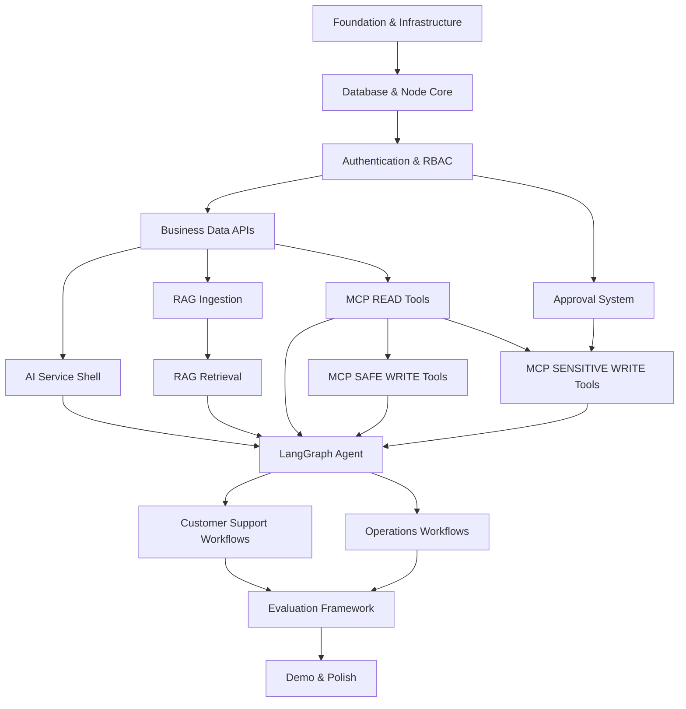
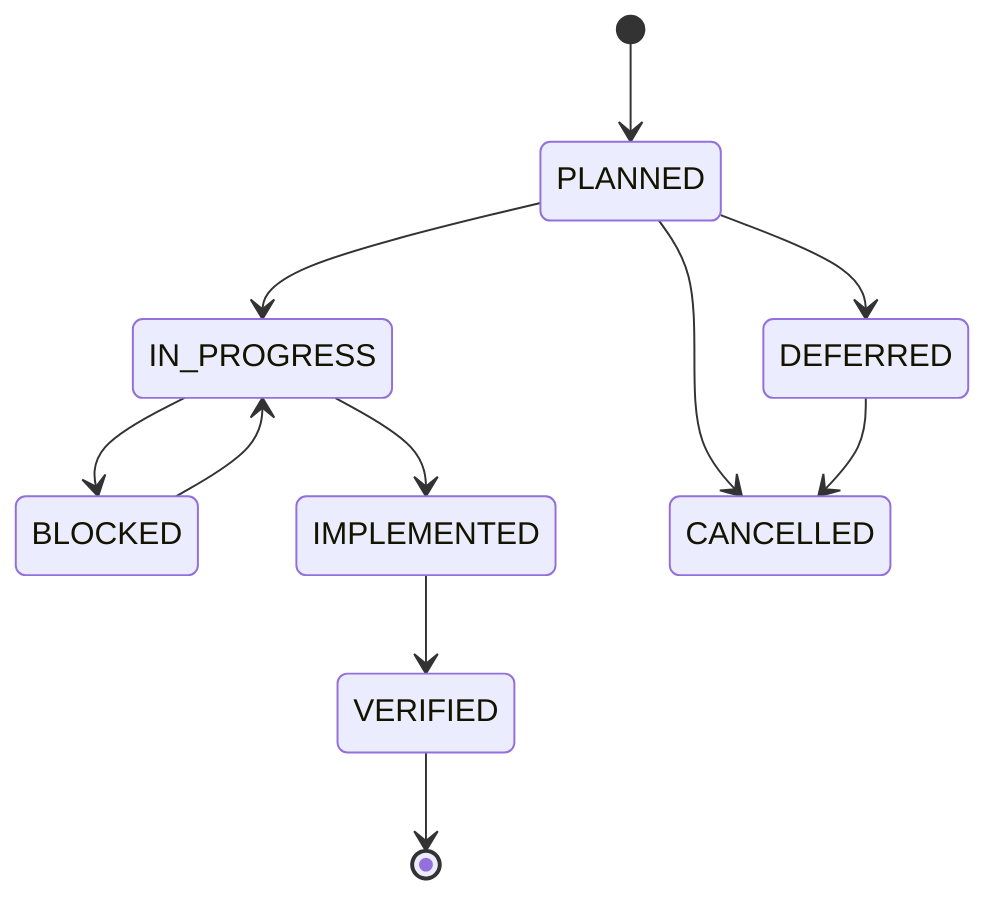
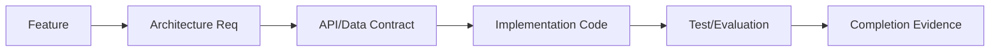

# ShopSphere AI - Features Backlog

*Status: Controlled / Approved Baseline*
*Source of Truth: docs/PROJECT_MASTER.md*

==================================================
## 1. PURPOSE
==================================================

This document defines the complete controlled feature backlog for ShopSphere AI.

Every feature explicitly answers:
- What are we building?
- Why are we building it?
- Is it MVP or future scope?
- What does it depend on?
- Which service/layer owns it?
- What are its acceptance criteria?
- How will it be tested?
- What security requirements apply?
- What documentation defines its behavior?
- What is its implementation status?

The purpose of this document is to prevent uncontrolled feature creation, architecture drift, duplicate implementations, and unplanned scope expansion. Antigravity must NOT independently invent major features during implementation. New major features must first be added to FEATURES.md and approved.

==================================================
## 2. SCOPE CONTROL PRINCIPLE
==================================================

**"Implementation follows the approved feature backlog; the AI coding agent must not expand project scope autonomously."**

A developer/AI agent may:
- implement an approved feature
- create files required by an approved feature
- refactor within existing architecture
- fix bugs
- add tests
- update implementation status

A developer/AI agent must NOT:
- invent major features
- introduce new infrastructure without approval
- introduce new frameworks without approval
- create alternative architectural layers
- create duplicate implementations
- create new agent types without approval
- add random abstractions
- change frozen architecture documents

==================================================
## 3. FEATURE ID CONVENTION
==================================================

Features use stable IDs that are not reused after deletion.

Format:
- FOUNDATION-XXX
- AUTH-XXX
- USER-XXX
- SUPPORT-XXX
- KNOWLEDGE-XXX
- RAG-XXX
- AGENT-XXX
- MCP-XXX
- OPS-XXX
- APPROVAL-XXX
- EVAL-XXX
- SECURITY-XXX
- UI-XXX
- DEMO-XXX

==================================================
## 4. FEATURE STATUS
==================================================

Allowed statuses:
- **PLANNED** → approved but not started
- **IN_PROGRESS** → currently being implemented
- **BLOCKED** → cannot continue because a dependency/decision is unresolved
- **IMPLEMENTED** → code exists but verification is incomplete
- **VERIFIED** → acceptance criteria and relevant tests/evaluation passed
- **DEFERRED** → intentionally moved out of current scope
- **CANCELLED** → removed from project scope

Do not use arbitrary status names.

==================================================
## 5. PRIORITY
==================================================

Allowed priorities:
- **P0** — Critical foundation/safety
- **P1** — Core MVP
- **P2** — Important enhancement
- **P3** — Optional polish
- **P4** — Future

P0 features represent critical foundations or safety requirements and should be completed before the dependent features that require them. Priority does not override explicit feature dependencies. Do not classify features based on how impressive they sound.

==================================================
## 6. FEATURE RECORD FORMAT
==================================================

Every feature must use this structure:

### [FEATURE-ID] — [Feature Name]
**Status:** [PLANNED | IN_PROGRESS | BLOCKED | IMPLEMENTED | VERIFIED | DEFERRED | CANCELLED]
**Priority:** [P0 | P1 | P2 | P3 | P4]
**Module:** [Subsystem]
**Owner Layer:** [Architectural Layer]
**Dependencies:** [Feature IDs]

#### Purpose
Why this feature exists.

#### Scope
What this feature includes.

#### Out of Scope
What this feature explicitly does NOT include.

#### Acceptance Criteria
Specific conditions that must be true for the feature to be considered implemented.

#### Security Requirements
Security constraints relevant to the feature.

#### Evaluation Requirements
How the feature will be tested/evaluated.

#### Documentation References
Relevant architecture/design documents.

#### Implementation Notes
Only concise implementation constraints. Do not turn this into source code.

#### Completion Evidence
Links/paths/tests/metrics to be added when verified.

==================================================
## 7. ARCHITECTURAL OWNERSHIP
==================================================

Every feature must identify its primary owner from the allowed layers:
- FRONTEND
- NODE_BACKEND
- AI_SERVICE
- DATABASE
- RAG
- MCP
- CROSS_SERVICE
- EVALUATION

Do not create ownership categories such as MANAGER, HELPER, UTILITY, or MISC.

==================================================
## 8. MVP BOUNDARY
==================================================

**MVP REQUIRED**: Features strictly necessary to fulfill the documented architecture and demonstrate the core capability locally.
**POST-MVP / FUTURE**: Features intentionally deferred to keep the project realistically buildable as a focused portfolio project. Do not add enterprise infrastructure merely because it sounds professional.

==================================================
## 9. MVP FOUNDATION FEATURES
==================================================

### FOUNDATION-001 — Project Structure & Environment
**Status:** IMPLEMENTED
**Priority:** P0
**Module:** Foundation
**Owner Layer:** CROSS_SERVICE
**Dependencies:** None

#### Purpose
Establish the core repository structure and base standards.
#### Scope
Repository layout, configuration validation, common request/correlation IDs, centralized error handling, and basic logging across layers.
#### Out of Scope
Deployment pipelines, CI/CD, production secrets managers.
#### Acceptance Criteria
- Directory structure matches PROJECT_MASTER.md.
- Correlation IDs flow through HTTP requests.
- Environment variables are validated on startup.
#### Security Requirements
- `.env` files are ignored by git.
#### Evaluation Requirements
- Basic startup tests pass.
#### Documentation References
- `PROJECT_MASTER.md`
- `architecture_guardrails.md`
#### Implementation Notes
- Use straightforward logging libraries.
#### Completion Evidence
- To be recorded.

### FOUNDATION-002 — Backend Shell & Database Connection
**Status:** PLANNED
**Priority:** P0
**Module:** Foundation
**Owner Layer:** NODE_BACKEND
**Dependencies:** FOUNDATION-001

#### Purpose
Establish the core business authority layer.
#### Scope
Node backend server shell, PostgreSQL connection configuration and pooling, basic health endpoints. Database schema persistence is handled here.
#### Out of Scope
Complex ORM frameworks if raw/query builder is preferred for MVP; caching layers like Redis.
#### Acceptance Criteria
- Node server starts and binds to configured port.
- Database connection successfully established.
- Health endpoint returns 200 OK.
#### Security Requirements
- Database credentials must be externalized in environment variables.
#### Evaluation Requirements
- API latency testing for health endpoint.
#### Documentation References
- `ARCHITECTURE.md`
#### Implementation Notes
- Keep database connection management centralized.
#### Completion Evidence
- To be recorded.

### FOUNDATION-003 — AI Service Shell
**Status:** PLANNED
**Priority:** P0
**Module:** Foundation
**Owner Layer:** AI_SERVICE
**Dependencies:** FOUNDATION-001

#### Purpose
Establish the Python service that will host LangGraph and Ollama interactions.
#### Scope
Python FastAPI shell, internal service-to-service authentication handler, health endpoint.
#### Out of Scope
Actual agent logic, database connections, LangChain logic.
#### Acceptance Criteria
- FastAPI server starts successfully.
- Health endpoint returns 200 OK.
- Rejects requests missing the service token.
#### Security Requirements
- Service-to-service authentication strictly enforced.
- NO database credentials provided to this service.
#### Evaluation Requirements
- Local latency testing.
#### Documentation References
- `API_CONTRACT.md`
- `SECURITY.md`
#### Implementation Notes
- Use standard FastAPI dependency injection for auth.
#### Completion Evidence
- To be recorded.

### FOUNDATION-004 — Frontend Shell
**Status:** PLANNED
**Priority:** P1
**Module:** Foundation
**Owner Layer:** FRONTEND
**Dependencies:** FOUNDATION-001

#### Purpose
Provide a user interface for interaction.
#### Scope
UI shell layout, routing, simple chat/operations interface scaffolding.
#### Out of Scope
Complex state management libraries (Redux), SSR frameworks unless specified.
#### Acceptance Criteria
- UI loads without errors.
- Connects to backend API.
#### Security Requirements
- No secrets in frontend bundle.
#### Evaluation Requirements
- Manual UI validation.
#### Documentation References
- `PROJECT_MASTER.md`
#### Implementation Notes
- Keep it a simple single-page application.
#### Completion Evidence
- To be recorded.

==================================================
## 10. AUTHENTICATION / USER FEATURES
==================================================

### AUTH-001 — Core Authentication & RBAC
**Status:** PLANNED
**Priority:** P0
**Module:** Auth
**Owner Layer:** NODE_BACKEND
**Dependencies:** FOUNDATION-002

#### Purpose
Provide the authorization authority for the system.
#### Scope
Session/token validation per `API_CONTRACT.md`, principal context creation, RBAC enforcement, protected routes/endpoints, and resource scope/ownership checks.
#### Out of Scope
Inventing new authentication mechanisms, Enterprise SSO, OAuth.
#### Acceptance Criteria
- Invalid tokens are rejected (401).
- Insufficient roles are rejected (403).
- Principal context is correctly populated.
#### Security Requirements
- Node is the strict authority. Principal context cannot be modified by AI.
- Fail closed on missing/invalid auth.
#### Evaluation Requirements
- Test unauthorized access attempts.
- Test role-based access limits.
#### Documentation References
- `API_CONTRACT.md`
- `SECURITY.md`
#### Implementation Notes
- Implement via standard Node middleware.
#### Completion Evidence
- To be recorded.

==================================================
## 11. CUSTOMER SUPPORT FEATURES
==================================================

### SUPPORT-001 — Customer & Order Data Model
**Status:** PLANNED
**Priority:** P1
**Module:** Customer Support
**Owner Layer:** NODE_BACKEND
**Dependencies:** AUTH-001

#### Purpose
Provide the core business data for the e-commerce scenario.
#### Scope
Schema and APIs for customer records, orders, and shipments.
#### Out of Scope
Payment processing, inventory management logic.
#### Acceptance Criteria
- Schemas created in PostgreSQL.
- Node APIs can read customer/order/shipment records.
#### Security Requirements
- Resource ownership validation (users can only see their own orders unless authorized).
#### Evaluation Requirements
- Unit testing for API endpoints.
#### Documentation References
- `DATA_MODEL.md`
#### Implementation Notes
- Ensure tables follow defined schema exactly.
#### Completion Evidence
- To be recorded.

### SUPPORT-002 — Ticketing System
**Status:** PLANNED
**Priority:** P1
**Module:** Customer Support
**Owner Layer:** NODE_BACKEND
**Dependencies:** AUTH-001

#### Purpose
Provide the operational support data.
#### Scope
Schema and APIs for support tickets, status, priority, search/filtering, and support conversation context.
#### Out of Scope
External email integrations.
#### Acceptance Criteria
- Ticket schemas created in PostgreSQL.
- API endpoints available for creating, reading, and filtering tickets.
#### Security Requirements
- Ensure appropriate RBAC for reading/writing tickets.
#### Evaluation Requirements
- Unit testing for API endpoints.
#### Documentation References
- `DATA_MODEL.md`
#### Implementation Notes
- Store conversation contexts related to tickets effectively.
#### Completion Evidence
- To be recorded.

==================================================
## 12. KNOWLEDGE / RAG FEATURES
==================================================

### RAG-001 — Document Ingestion & Chunking
**Status:** PLANNED
**Priority:** P1
**Module:** Knowledge
**Owner Layer:** RAG
**Dependencies:** SUPPORT-001

#### Purpose
Prepare knowledge base documents for retrieval.
#### Scope
Upload, validation, parsing, and chunking of knowledge documents. Lifecycle state (draft, published) and versioning tracking.
#### Out of Scope
Complex OCR for images, internet scraping.
#### Acceptance Criteria
- Documents can be uploaded and successfully chunked.
- Metadata is attached properly.
#### Security Requirements
- Validate file types and sizes. Path traversal protection.
#### Evaluation Requirements
- Chunk quality checks.
#### Documentation References
- `RAG_DESIGN.md`
- `SECURITY.md`
#### Implementation Notes
- Keep ingestion separate from retrieval flow.
#### Completion Evidence
- To be recorded.

### RAG-002 — Vector Indexing & Retrieval
**Status:** PLANNED
**Priority:** P1
**Module:** Knowledge
**Owner Layer:** RAG
**Dependencies:** RAG-001

#### Purpose
Provide relevant knowledge context to the AI.
#### Scope
Embeddings, Qdrant indexing, retrieval, metadata filtering, source attribution, and no-answer fallback.
#### Out of Scope
Fine-tuning embedding models.
#### Acceptance Criteria
- Embeddings correctly stored in Qdrant.
- Retrieval returns relevant chunks with source metadata.
#### Security Requirements
- Retrieved context is strictly UNTRUSTED data.
#### Evaluation Requirements
- Precision@K, Recall@K, Unsupported Answer Rate.
#### Documentation References
- `RAG_DESIGN.md`
- `EVALUATION.md`
#### Implementation Notes
- Qdrant runs locally.
#### Completion Evidence
- To be recorded.

==================================================
## 13. MCP FEATURES
==================================================

### MCP-001 — READ Capabilities
**Status:** PLANNED
**Priority:** P1
**Module:** MCP
**Owner Layer:** MCP
**Dependencies:** AUTH-001, SUPPORT-001, SUPPORT-002

#### Purpose
Provide data retrieval tools for the agent.
#### Scope
Implementation of read-only MCP tools (`get_order`, `get_shipment`, `search_tickets`, `get_customer`). Authorization verification required.
#### Out of Scope
Data modification.
#### Acceptance Criteria
- Tools successfully retrieve authorized data from Node APIs.
- Rejected when unauthorized.
#### Security Requirements
- Node MCP Server enforces RBAC and resource limits.
- PII minimized in output.
#### Evaluation Requirements
- MCP tool latency testing.
#### Documentation References
- `MCP_DESIGN.md`
- `API_CONTRACT.md`
#### Implementation Notes
- Ensure output schema matches expected MCP interface.
#### Completion Evidence
- To be recorded.

### MCP-002 — SAFE WRITE Capabilities
**Status:** PLANNED
**Priority:** P1
**Module:** MCP
**Owner Layer:** MCP
**Dependencies:** MCP-001

#### Purpose
Provide low-risk state modification tools.
#### Scope
Implementation of safe mutating tools (`create_task`, `assign_task`, `add_ticket_note`). Idempotency and authorization required.
#### Out of Scope
Sensitive financial actions.
#### Acceptance Criteria
- Tasks and notes are successfully created when authorized.
- Duplicate requests are rejected (idempotency).
#### Security Requirements
- Idempotency checks required. Input validation.
#### Evaluation Requirements
- Duplicate Mutation Rate testing (Target: 0).
#### Documentation References
- `MCP_DESIGN.md`
- `SECURITY.md`
#### Implementation Notes
- Implement idempotency keys in Node layer.
#### Completion Evidence
- To be recorded.

==================================================
## 14. APPROVAL FEATURES
==================================================

### APPROVAL-001 — Sensitive Action Approval System
**Status:** PLANNED
**Priority:** P0
**Module:** Approvals
**Owner Layer:** NODE_BACKEND
**Dependencies:** AUTH-001

#### Purpose
Gatekeeper for sensitive operations.
#### Scope
`ApprovalRequest` creation, pending state logic, manager approval/rejection/expiration, execution of the exact persisted action, rejection/approval follow-up via NEW AI invocation, and audit logging.
#### Out of Scope
Automated approvals by AI.
#### Acceptance Criteria
- Pending approvals prevent immediate execution.
- Only authorized managers can approve.
- Persisted action executes exactly upon approval.
#### Security Requirements
- The AI cannot modify or bypass approval state.
- Exact persisted action execution.
#### Evaluation Requirements
- Approval Bypass Rate testing (Target: 0%).
#### Documentation References
- `SECURITY.md`
- `EVALUATION.md`
#### Implementation Notes
- Persist `ApprovalRequest` safely in PostgreSQL.
#### Completion Evidence
- To be recorded.

==================================================
## 15. SENSITIVE MCP FEATURES
==================================================

### MCP-003 — SENSITIVE WRITE Capabilities
**Status:** PLANNED
**Priority:** P0
**Module:** MCP
**Owner Layer:** MCP
**Dependencies:** MCP-001, APPROVAL-001

#### Purpose
Provide high-risk state modification tools via the approval gate.
#### Scope
Implementation of sensitive tools (`request_refund`, `cancel_order`) returning `ApprovalRequest` instead of immediate execution.
#### Out of Scope
Immediate execution of refunds/cancellations.
#### Acceptance Criteria
- Calling tool produces an ApprovalRequest.
- Action does not immediately execute.
#### Security Requirements
- Requires Idempotency.
- Must halt AI execution when triggered.
#### Evaluation Requirements
- Approval safety evaluation.
#### Documentation References
- `MCP_DESIGN.md`
- `SECURITY.md`
#### Implementation Notes
- Tie directly into APPROVAL-001 endpoints.
#### Completion Evidence
- To be recorded.

==================================================
## 16. AGENT FEATURES
==================================================

### AGENT-001 — Primary LangGraph Agent
**Status:** PLANNED
**Priority:** P1
**Module:** Agent
**Owner Layer:** AI_SERVICE
**Dependencies:** FOUNDATION-003, RAG-002, MCP-001, MCP-002, MCP-003

#### Purpose
The core intelligence and orchestration logic.
#### Scope
Single primary LangGraph graph handling request intake, context preparation, classification, routing (KNOWLEDGE_QUERY, CUSTOMER_SUPPORT, OPERATIONS_TASK, GENERAL), RAG/MCP invocation, result validation, response generation, clarification handling, failure handling, tool-step budget, and conversation context handling.
#### Out of Scope
Multiple specialized agents, autonomous swarms, unapproved alternative graphs.
#### Acceptance Criteria
- Graph correctly routes requests.
- RAG and MCP tools are called appropriately based on intent.
- Safe termination on failures.
#### Security Requirements
- Cannot access database directly.
- Handles untrusted RAG text and sanitizes outputs.
#### Evaluation Requirements
- Routing Accuracy, Tool Selection Accuracy, Argument Correctness.
#### Documentation References
- `AGENT_DESIGN.md`
- `AI_ARCHITECTURE.md`
#### Implementation Notes
- Implement via standard LangGraph Node/Edge structure.
#### Completion Evidence
- To be recorded.

==================================================
## 17. APPROVED TOOL CATALOG
==================================================

| Tool | Category | Risk | Purpose | Approval Required | Idempotency | Owner |
| :--- | :--- | :--- | :--- | :--- | :--- | :--- |
| `get_order` | READ | SAFE | Retrieve order details | No | N/A | Node/MCP |
| `get_shipment` | READ | SAFE | Retrieve shipment status | No | N/A | Node/MCP |
| `search_tickets` | READ | SAFE | Query support tickets | No | N/A | Node/MCP |
| `get_customer` | READ | SAFE | Retrieve customer data | No | N/A | Node/MCP |
| `create_task` | WRITE | SAFE | Create operational task | No | Yes | Node/MCP |
| `assign_task` | WRITE | SAFE | Assign task to user | No | Yes | Node/MCP |
| `add_ticket_note` | WRITE | SAFE | Add internal note | No | Yes | Node/MCP |
| `request_refund` | WRITE | SENSITIVE | Initiate refund | Yes | Yes | Node/MCP |
| `cancel_order` | WRITE | SENSITIVE | Initiate order cancel | Yes | Yes | Node/MCP |

==================================================
## 18. CUSTOMER SUPPORT AGENT FEATURES
==================================================

### SUPPORT-003 — Customer Support Workflows
**Status:** PLANNED
**Priority:** P1
**Module:** Customer Support
**Owner Layer:** CROSS_SERVICE
**Dependencies:** AGENT-001

#### Purpose
Execute end-to-end customer support operations.
#### Scope
E2E support handling using the primary agent:
1. Knowledge-only question
2. Live order question
3. Shipment/status question
4. Ticket question
5. Policy + live business question
6. Safe support operation
7. Sensitive support operation
8. Approval-required support operation
9. Ambiguous support request
10. No-evidence support question
#### Out of Scope
Inventing policies not in RAG.
#### Acceptance Criteria
- Successful end-to-end execution of the 10 core scenarios.
#### Security Requirements
- Adhere strictly to authorization boundaries during execution.
#### Evaluation Requirements
- End-to-End Task Success Rate.
#### Documentation References
- `PROJECT_SPEC.md`
#### Implementation Notes
- Rely entirely on the capabilities built into AGENT-001, RAG, and MCP.
#### Completion Evidence
- To be recorded.

==================================================
## 19. COMPANY OPERATIONS FEATURES
==================================================

### OPS-001 — Operational Workflows
**Status:** PLANNED
**Priority:** P1
**Module:** Operations
**Owner Layer:** CROSS_SERVICE
**Dependencies:** AGENT-001

#### Purpose
Execute internal company operations efficiently.
#### Scope
E2E operations handling using the SAME primary agent:
- company knowledge queries
- ticket discovery, prioritization, filtering
- operational task creation/assignment
- operational summaries
- policy + operational-data workflows
- safe operational actions
#### Out of Scope
Specialized autonomous operational agents.
#### Acceptance Criteria
- Operations scenarios succeed correctly using existing tools.
#### Security Requirements
- Requires appropriate operations/internal RBAC.
#### Evaluation Requirements
- End-to-End Task Success Rate.
#### Documentation References
- `PROJECT_SPEC.md`
#### Implementation Notes
- Ensure classification logic routes internal tasks properly.
#### Completion Evidence
- To be recorded.

==================================================
## 20. SECURITY FEATURES
==================================================

### SECURITY-001 — Core Defenses
**Status:** PLANNED
**Priority:** P0
**Module:** Security
**Owner Layer:** CROSS_SERVICE
**Dependencies:** FOUNDATION-001

#### Purpose
Ensure system safety against adversarial action.
#### Scope
Input validation, authentication/authorization enforcement, prompt injection & RAG poisoning defenses, tool argument validation, secret protection, PII minimization, audit logging, rate/size limits, path traversal protection, fail-closed behavior, and idempotency logic.
#### Out of Scope
WAF or external SIEM setup.
#### Acceptance Criteria
- Prompt injections do not result in tool execution.
- Rate limits successfully block abuse.
#### Security Requirements
- This is the security layer implementation itself.
#### Evaluation Requirements
- Run adversarial evaluation suite.
#### Documentation References
- `SECURITY.md`
#### Implementation Notes
- Implement defensively at every API boundary.
#### Completion Evidence
- To be recorded.

==================================================
## 21. EVALUATION FEATURES
==================================================

### EVAL-001 — Evaluation Framework
**Status:** PLANNED
**Priority:** P1
**Module:** Evaluation
**Owner Layer:** EVALUATION
**Dependencies:** SUPPORT-003, OPS-001

#### Purpose
Prove correct behavior of the system reliably.
#### Scope
Curated dataset schemas, RAG retrieval evaluation, routing/tool-selection/argument/sequence evaluation, business outcome verification, approval safety tests, adversarial/failure tests, latency measurement, and regression tooling.
#### Out of Scope
Creating LLM-as-a-judge frameworks or massive synthetic datasets.
#### Acceptance Criteria
- Can run evaluation suites locally and generate metrics.
#### Security Requirements
- Not applicable.
#### Evaluation Requirements
- Framework must reliably catch regressions.
#### Documentation References
- `EVALUATION.md`
#### Implementation Notes
- Keep scripts minimal and deterministic.
#### Completion Evidence
- To be recorded.

==================================================
## 22. DEMO FEATURES
==================================================

### DEMO-001 — Live Demonstration Set
**Status:** PLANNED
**Priority:** P1
**Module:** Demo
**Owner Layer:** CROSS_SERVICE
**Dependencies:** EVAL-001

#### Purpose
Provide a structured, impressive presentation of the system.
#### Scope
Locally executable demonstration scenarios without internet dependency:
- Knowledge question → RAG
- Live order question → MCP
- Policy + live order → RAG + MCP
- Safe operation → MCP
- Sensitive operation → ApprovalRequest
- Manager approval → execution
- Prompt injection → blocked
- Unknown knowledge → honest no-answer
- Tool failure → safe failure
#### Out of Scope
Deploying to public clouds for the demo.
#### Acceptance Criteria
- All 9 demo scenarios work flawlessly.
#### Security Requirements
- Demo must accurately reflect actual security policies.
#### Evaluation Requirements
- Pass all demo scripts interactively.
#### Documentation References
- `EVALUATION.md`
#### Implementation Notes
- Ensure database is seeded correctly for the demo.
#### Completion Evidence
- To be recorded.

==================================================
## 23. DEPENDENCY GRAPH
==================================================

==================================================
## 24. IMPLEMENTATION ORDER
==================================================

- **PHASE 0:** Governance / documentation / repository structure
- **PHASE 1:** Foundation + infrastructure
- **PHASE 2:** Authentication + RBAC
- **PHASE 3:** Business data + core Node APIs
- **PHASE 4:** Knowledge ingestion + RAG
- **PHASE 5:** MCP + safe tools
- **PHASE 6:** Sensitive tools + approvals
- **PHASE 7:** AI Service + LangGraph
- **PHASE 8:** Customer Support Agent workflows
- **PHASE 9:** Company Operations Agent workflows
- **PHASE 10:** Evaluation + security testing
- **PHASE 11:** Demo + polish + documentation

*Implementation order may be adjusted when real technical dependencies require it, but changes must be recorded.*

==================================================
## 25. DEFINITION OF DONE
==================================================

A feature is VERIFIED only when:
- implementation exists
- acceptance criteria pass
- relevant tests pass
- security requirements pass
- evaluation requirements pass where applicable
- no architecture boundary is violated
- documentation/status is updated
- no duplicate implementation exists

**"Code exists" does NOT mean "feature complete."**

==================================================
## 26. DUPLICATE / STRUCTURE CONTROL
==================================================

Before creating a new file, service, controller, route, component, utility, or module:
1. Search the repository.
2. Check FEATURES.md.
3. Check existing architecture.
4. Reuse existing approved module if appropriate.
5. Only create a new module when the feature requires it.

**Never create:**
- duplicate services
- duplicate utilities
- duplicate API clients
- random service folders
- `service/` alongside `services/`
- arbitrary `manager/` folders
- arbitrary `helpers/` folders
- alternative architectural layers

Directory structure must strictly follow `PROJECT_MASTER.md` and `architecture_guardrails.md`.

==================================================
## 27. FEATURE CHANGE CONTROL
==================================================

**New feature request process:**
1. Identify why it is needed.
2. Check whether an existing feature already covers it.
3. Determine architectural impact.
4. Assign Feature ID.
5. Define dependencies.
6. Define acceptance criteria.
7. Determine MVP vs post-MVP.
8. Check frozen architecture for conflicts.
9. Add to `FEATURES.md`.
10. Only then implement.

If a feature requires changing frozen architecture: **STOP.** Create/document an architecture decision before implementation.

==================================================
## 28. FEATURE TRACEABILITY
==================================================

Each feature should be traceable to:
`Feature → Architecture requirement → API/Data contract → Implementation location → Test/Evaluation → Completion evidence`

*A traceability table for major MVP features will be populated during implementation.*

==================================================
## 29. MVP FEATURE SUMMARY
==================================================

| Feature ID | Feature | Priority | Owner | Dependencies | Status |
| :--- | :--- | :--- | :--- | :--- | :--- |
| FOUNDATION-001 | Project Structure & Env | P0 | CROSS_SERVICE | None | PLANNED |
| FOUNDATION-002 | Backend Shell & DB | P0 | NODE_BACKEND | FOUNDATION-001 | PLANNED |
| FOUNDATION-003 | AI Service Shell | P0 | AI_SERVICE | FOUNDATION-001 | PLANNED |
| FOUNDATION-004 | Frontend Shell | P1 | FRONTEND | FOUNDATION-001 | PLANNED |
| AUTH-001 | Core Auth & RBAC | P0 | NODE_BACKEND | FOUNDATION-002 | PLANNED |
| SUPPORT-001 | Customer & Order Data | P1 | NODE_BACKEND | AUTH-001 | PLANNED |
| SUPPORT-002 | Ticketing System | P1 | NODE_BACKEND | AUTH-001 | PLANNED |
| RAG-001 | Ingestion & Chunking | P1 | RAG | SUPPORT-001 | PLANNED |
| RAG-002 | Vector Index & Retrieval | P1 | RAG | RAG-001 | PLANNED |
| MCP-001 | READ Capabilities | P1 | MCP | AUTH-001, SUPPORT-001, SUPPORT-002 | PLANNED |
| MCP-002 | SAFE WRITE Capabilities | P1 | MCP | MCP-001 | PLANNED |
| APPROVAL-001 | Sensitive Approval System | P0 | NODE_BACKEND | AUTH-001 | PLANNED |
| MCP-003 | SENSITIVE WRITE Cap. | P0 | MCP | MCP-001, APPROVAL-001| PLANNED |
| AGENT-001 | Primary LangGraph Agent | P1 | AI_SERVICE | FOUNDATION-003, RAG-002, MCP-001, MCP-002, MCP-003 | PLANNED |
| SUPPORT-003 | Agent Workflows | P1 | CROSS_SERVICE | AGENT-001 | PLANNED |
| OPS-001 | Operational Workflows | P1 | CROSS_SERVICE | AGENT-001 | PLANNED |
| SECURITY-001 | Core Defenses | P0 | CROSS_SERVICE | FOUNDATION-001 | PLANNED |
| EVAL-001 | Evaluation Framework | P1 | EVALUATION | SUPPORT-003, OPS-001 | PLANNED |
| DEMO-001 | Live Demonstration Set | P1 | CROSS_SERVICE | EVAL-001 | PLANNED |

==================================================
## 30. POST-MVP / FUTURE FEATURES
==================================================

The following are intentionally deferred:
- advanced long-term memory
- multiple specialized agents
- external MCP servers
- cloud LLM providers
- enterprise SSO
- production secret managers
- advanced analytics
- distributed deployment
- advanced observability
- large-scale load testing

Do not let these enter MVP accidentally.

==================================================
## 31. CHANGELOG / STATUS TRACKING
==================================================

*Lightweight status history (Do not use as full Git history):*
- Initial creation of FEATURES.md backlog (PLANNED states set).

==================================================
## 32. DIAGRAMS
==================================================

### 1. Feature Dependency Graph
(See Section 23)

### 2. Implementation Phases

```mermaid
flowchart LR
    P0[Phase 0: Gov] --> P1[Phase 1: Foundation]
    P1 --> P2[Phase 2: Auth]
    P2 --> P3[Phase 3: Biz Data]
    P3 --> P4[Phase 4: RAG]
    P4 --> P5[Phase 5: Safe MCP]
    P5 --> P6[Phase 6: Approvals & Sensitive MCP]
    P6 --> P7[Phase 7: Agent]
    P7 --> P8[Phase 8: CS Workflows]
    P8 --> P9[Phase 9: Ops Workflows]
    P9 --> P10[Phase 10: Evaluation]
    P10 --> P11[Phase 11: Demo]
```

### 3. Feature Lifecycle

### 4. Traceability Flow

==================================================
## 33. FINAL VALIDATION
==================================================

1. No circular feature dependencies.
2. MCP does not depend on LangGraph.
3. LangGraph depends on required MCP capabilities.
4. Every MVP feature has the required feature-record fields.
5. Every feature has a single primary Owner Layer.
6. Operations is P1/Core MVP.
7. Operations still uses the same primary LangGraph agent.
8. No unapproved MCP tools are introduced.
9. Node remains business/authorization authority.
10. PostgreSQL remains business source of truth.
11. Sensitive actions require ApprovalRequest.
12. Duplicate implementation prevention remains intact.
13. New major features require backlog approval.
14. No application code is created.
15. No dependencies are installed.
