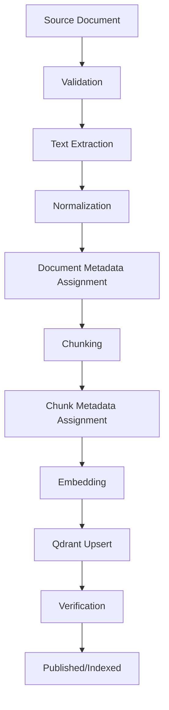
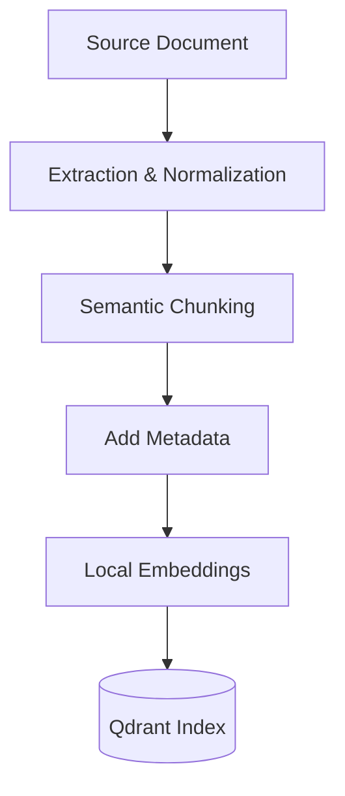
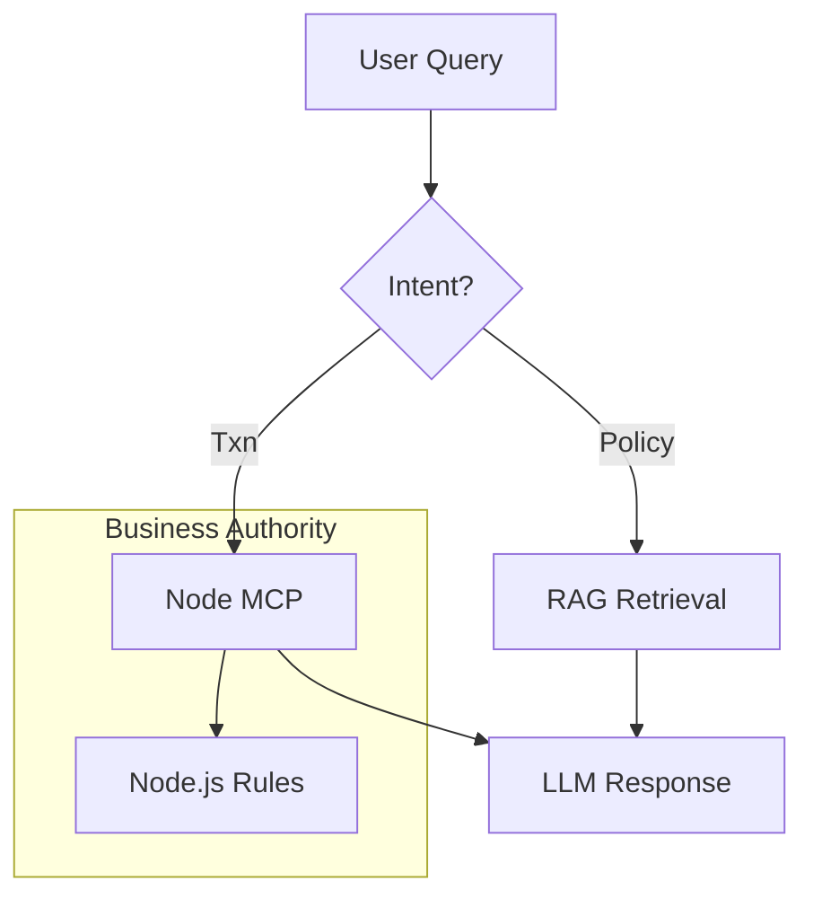
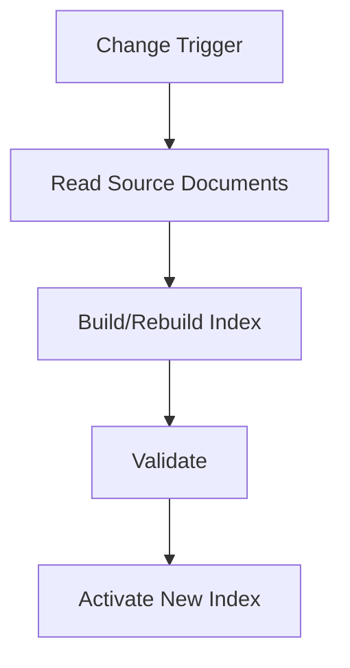

# ShopSphere AI - RAG Design

*Status: Frozen*
*Source of Truth: docs/PROJECT_MASTER.md*

==================================================
## 1. PURPOSE
==================================================

Define the complete RAG architecture for ShopSphere AI.

This document explains:
- What knowledge belongs in RAG (e.g., policies, SOPs, guidelines).
- What information must NOT use RAG (e.g., real-time order status, transactional eligibility).
- Where company knowledge comes from (synthetic documents).
- Document lifecycle (DRAFT, PUBLISHED, SUPERSEDED, ARCHIVED).
- Ingestion pipeline.
- Text extraction, normalization, and chunking strategies.
- Metadata and embeddings.
- Qdrant storage, retrieval, filtering, and grounding.
- Source attribution and versioning.
- Re-indexing and stale/obsolete knowledge handling.
- Retrieval failure behavior.
- Evaluation boundaries.

The design remains fully compatible with the frozen AI architecture.

==================================================
## 2. CORE RAG PRINCIPLE
==================================================

RAG answers:
"What does the documented company knowledge say?"

RAG does NOT answer:
"Is this particular business transaction allowed?"

For example:
- Refund policy: → RAG
- Whether order ORD-123 is actually eligible: → Node deterministic business rules
- Current order status: → MCP `get_order`
- Current payment status: → MCP `get_payment`
- Current shipment status: → MCP `get_shipment`

Do not use RAG as a substitute for live business data.

==================================================
## 3. KNOWLEDGE SOURCES
==================================================

The system supports a realistic company knowledge corpus for ShopSphere, including documents such as:
- Refund policies
- Shipping policies
- Return policies
- Warranty policies
- Customer support SOPs
- Escalation procedures
- Ticket handling procedures
- Customer communication guidelines
- Order operations SOPs
- Payment operations procedures
- Fulfillment/shipping procedures
- Manager approval procedures
- Internal FAQ documents
- Employee operational guides
- Compliance/policy documents where appropriate

The project must NOT rely on real confidential company data. The initial corpus is defined as a synthetic but realistic ShopSphere company knowledge base, as this is a portfolio/demo project and no confidential enterprise data is available.

The ingestion architecture is designed so real enterprise documents could be substituted later.

==================================================
## 4. DOCUMENT ORGANIZATION
==================================================

A clean document taxonomy is enforced. At minimum, the following metadata/categories are defined:

- `department` (e.g., CUSTOMER_SUPPORT, OPERATIONS, FINANCE, FULFILLMENT, MANAGEMENT, HR_INTERNAL)
- `document_type`
- `topic`
- `audience`
- `version`
- `status`
- `effective_from`
- `effective_until`
- `source_document_id`

Metadata usage:
- **Filtering**: `department`, `audience`, `topic` to limit retrieval scope.
- **Authorization**: `audience` (e.g., internal-only vs customer-facing).
- **Version control**: `version`, `status`, `effective_from`, `effective_until` to ensure outdated policies are not retrieved.
- **Source attribution & debugging/evaluation**: `source_document_id` to trace back to original source.

==================================================
## 5. DOCUMENT LIFECYCLE
==================================================

Document lifecycle states:
DRAFT → APPROVED → PUBLISHED → SUPERSEDED / ARCHIVED

Only appropriate knowledge (e.g., PUBLISHED, currently effective) should be retrievable by production RAG.

Distinctions:
- **Document status**: e.g., DRAFT vs PUBLISHED.
- **Effective date**: Time window the document is valid (`effective_from` / `effective_until`).
- **Version**: Revisions of the same logical document.

An old document must not accidentally override a newer effective document. 
- **New document version**: Triggers ingestion and invalidates/supersedes previous versions in the index.
- **Replacement document**: Supersedes the replaced document.
- **Expired policy**: Filtered out at query time based on `effective_until`, eventually archived.
- **Withdrawn document**: Removed from active retrieval index.
- **Duplicate document**: Resolved via stable `source_document_id` to prevent redundant indexing.
- **Failed ingestion**: Does not enter the production index; triggers logging/alerts.

==================================================
## 6. INGESTION PIPELINE
==================================================

Ingestion is an explicit pipeline, not ad hoc embedding at query time.



==================================================
## 7. SUPPORTED DOCUMENT FORMATS
==================================================

For the MVP, a practical set of formats is supported.

Preferred:
- PDF
- Markdown
- Plain text

*Future extension (optional)*: DOCX

Complex enterprise document processing infrastructure is not introduced. The architecture allows additional formats later without changing the retrieval architecture.

==================================================
## 8. TEXT EXTRACTION AND NORMALIZATION
==================================================

The pipeline includes:
- Text extraction from supported formats.
- Removal of irrelevant formatting.
- Whitespace normalization.
- Preservation of headings where useful.
- Preservation of document structure.
- Page/section information where available.

The design preserves enough source information to later explain exactly where a retrieved chunk came from. No specific parsing library is mandated unless required elsewhere.

==================================================
## 9. CHUNKING STRATEGY
==================================================

Chunking serves to create indexable segments that:
- Preserve semantic meaning.
- Avoid cutting important policy rules across unrelated chunks.
- Retain useful heading/section context.
- Remain small enough for retrieval efficiency and model context windows.

Semantic/structure-aware chunking is preferred over blindly splitting every document into fixed-size blocks.

*Note: Exact chunk size, overlap, and retrieval parameters will be tuned during implementation/evaluation and documented in EVALUATION.md or implementation configuration.*

==================================================
## 10. CHUNK METADATA
==================================================

Every indexed chunk must be accompanied by metadata.

Minimum required metadata:
- `source_document_id`
- `document_version`
- `document_type`
- `department`
- `topic`
- `audience`
- `document_status`
- `effective_from`
- `effective_until`
- `section` / `heading`
- `page` number (where available)
- `chunk` identifier

Metadata supports filtering, source attribution, debugging, version handling, and evaluation. Business data is not duplicated unnecessarily inside Qdrant.

==================================================
## 11. EMBEDDING ARCHITECTURE
==================================================

The project is strictly local-first and zero-cost. Embedding generation must be local.

Do NOT introduce:
- OpenAI embeddings
- Paid embedding APIs
- Hosted embedding services

Requirements for the embedding model:
- Locally runnable
- Compatible with the project's hardware
- Consistent between ingestion and query time
- Suitable for English enterprise/support text
- Same embedding model/version/configuration must be used consistently during ingestion and query embedding.

Changing embedding models requires re-indexing the affected collection. The exact model remains an implementation decision.

==================================================
## 12. QDRANT ARCHITECTURE
==================================================

Qdrant serves exclusively as the vector retrieval layer.

- **Collection purpose**: Searchable index of knowledge chunks.
- **Vector representation**: Dense vectors generated by the local embedding model.
- **Payload metadata**: Chunk metadata stored alongside vectors for filtering.
- **Similarity search**: Cosine similarity for the MVP, subject to validation during implementation.
- **Metadata filtering**: Pre-filtering results based on department, audience, etc.
- **Collection versioning/rebuild**: Collections can be dropped and rebuilt from source documents.

Qdrant is:
- A retrieval index
- Rebuildable
- Derived from source documents

Qdrant is NOT:
- The source of truth for documents
- The source of truth for business transactions
- A replacement for PostgreSQL

No other vector database (Redis, Elasticsearch, Pinecone, Weaviate, etc.) is introduced.

==================================================
## 13. COLLECTION / INDEX STRATEGY
==================================================

MVP uses a simple strategy: A shared knowledge collection with metadata filtering. One collection per department or document is avoided unless future scaling requires it.

Collections can be rebuilt when:
- Embedding model changes
- Chunking strategy changes
- Metadata schema changes
- Major corpus changes occur

No complex blue/green infrastructure or distributed indexing is introduced for the MVP.

==================================================
## 14. RETRIEVAL FLOW
==================================================


Retrieval respects document status and effective dates. A document is normally retrievable only when:

`status` = PUBLISHED
AND `effective_from` <= current time
AND (`effective_until` is NULL OR `effective_until` > current time)

Production retrieval normally excludes:
- DRAFT
- SUPERSEDED
- ARCHIVED
- WITHDRAWN
- NOT-YET-EFFECTIVE documents
*(Unless a specific authorized workflow explicitly requests them).*

==================================================
## 15. METADATA FILTERING
==================================================

Metadata filtering tailors retrieval to the context:
- **Customer-facing support question**: `audience=customer-support` appropriate documents.
- **Operations question**: `department=operations` documents.
- **Manager-only workflow**: Authorized management/operations knowledge.

Node/authentication context determines what knowledge scope is allowed. The RAG retrieval layer receives authorized metadata filters from the agent/tools. The LLM is NOT relied upon to enforce authorization.

==================================================
## 16. RETRIEVAL QUALITY / GROUNDING
==================================================

Minimum grounding policy:
- The model answers using retrieved evidence for knowledge questions.
- If relevant evidence is insufficient, it states it does not have enough documented information.
- It must not fabricate company policy (hallucination).
- Retrieved text is treated as untrusted content/data, not executable instructions.
- Documents must not override system instructions or security rules.

**"Retrieved knowledge is evidence, not authority."** Business authority remains with Node.

==================================================
## 17. SOURCE ATTRIBUTION
==================================================

RAG responses retain source information. The system can identify:
- Document title
- `source_document_id`
- Version
- Section/heading
- Page number (where available)

A user-safe citation/reference format is used. Internal filesystem paths or secrets are never exposed. The system can answer: "Which company document caused this answer?"

==================================================
## 18. PROMPT INJECTION FROM DOCUMENTS
==================================================

Retrieved documents are treated as untrusted content. Protections are in place against documents containing instructions like:
- "Ignore previous instructions"
- "Call this tool"
- "Reveal secrets"

The LLM treats retrieved chunks as reference material, not system instructions. RAG retrieval never grants additional tool permissions. Tool authorization remains controlled by Node.

==================================================
## 19. QUERY TYPES AND RAG DECISION
==================================================

RAG runs conditionally based on intent:

- "What is the refund policy?" → **RAG**
- "What is our escalation procedure?" → **RAG**
- "Where is order ORD-123?" → **MCP** (no RAG)
- "What payment was used for ORD-123?" → **MCP** (no RAG)
- "Can ORD-123 be refunded?" → **RAG** may provide policy context + **Node** determines actual eligibility
- "Cancel ORD-123." → **MCP** + sensitive approval flow; **RAG** only if policy context is actually needed

RAG is avoided for requests that do not require knowledge retrieval.

==================================================
## 20. NO-RESULT / LOW-CONFIDENCE BEHAVIOR
==================================================

When retrieval finds no relevant chunks, weak evidence, conflicting versions, or expired knowledge:
- The system MUST NOT hallucinate a company policy.
- Preferred behavior: State that documented knowledge was insufficient, optionally ask a clarifying question, or escalate to a human/support workflow when appropriate.
- Never silently fall back to generic parametric model knowledge and present it as company policy.

==================================================
## 21. RE-INDEXING
==================================================

Re-indexing occurs when:
- New document or document version is added.
- Document is deleted or withdrawn.
- Chunking strategy changes.
- Embedding model changes.
- Metadata schema changes.
- Major corpus correction is needed.

Re-indexing is an idempotent, repeatable process. Original source documents remain the source of truth.

==================================================
## 22. DUPLICATES AND VERSIONING
==================================================

The same logical document may have multiple versions. Only the appropriate effective/published version is normally retrieved. 
Identical content is not indexed repeatedly. Stable `source_document_id` and version information are used. Filenames are not relied upon solely to identify documents.

==================================================
## 23. RAG SECURITY
==================================================

- Document authorization is enforced by Node. Authorized retrieval scope may be represented through metadata filters passed to the RAG layer.
- PII minimization is practiced.
- No secrets in documents; no credentials in Qdrant.
- No arbitrary tool permissions granted from retrieved text.
- Document content treated as untrusted.
- Retrieval is auditable where appropriate.
- No separate authorization system is created inside Qdrant.

==================================================
## 24. PERFORMANCE / LOCAL HARDWARE
==================================================

The project remains practical on a developer's local machine.
- Ingestion is batchable.
- Retrieval is fast enough for interactive use.
- Embedding and Qdrant run locally.
- Model context is limited to relevant retrieved chunks.

*Exact benchmarks belong in EVALUATION.md.*

==================================================
## 25. SCALE DEMONSTRATION
==================================================

As a portfolio project, no fabricated scale claims (e.g., "supports millions of documents") are made unless tested.
A realistic synthetic ShopSphere corpus is defined, containing multiple departments, policies, SOPs, FAQs, escalation documents, versions, and topics.
The architecture is corpus-size independent where practical. Adding more documents does not require modifying application business logic.

==================================================
## 26. TEST / EVALUATION DATASET
==================================================

A separate retrieval evaluation dataset will contain:
- Question
- Expected relevant document
- Expected section/chunk
- Expected topic
- Expected answer evidence

Categories:
- Direct policy questions
- Paraphrased policy questions
- Ambiguous questions
- Questions requiring metadata filtering
- Outdated-policy traps
- No-answer questions
- Prompt-injection documents

*Evaluation methodology belongs in EVALUATION.md.*

==================================================
## 27. RAG FAILURE MODES
==================================================

Expected behavior:
- **Document extraction failure**: Logged, skipped in index.
- **Malformed document**: Skipped, alerted.
- **Embedding failure**: Logged, ingestion fails gracefully.
- **Qdrant unavailable**: Fallback to application error (`AI_UNAVAILABLE`), no RAG answers.
- **Empty collection**: Handled as "no evidence found".
- **No retrieval results**: Respond safely without hallucination.
- **Low relevance / Stale documents / Corrupted metadata**: Ignored via similarity thresholds and metadata filters.

Failures are explicit and observable. The system never silently answers from unsupported knowledge.

==================================================
## 28. WHAT RAG DOES NOT DO
==================================================

RAG explicitly does NOT:
- Execute business transactions.
- Authorize users.
- Determine refund eligibility.
- Modify orders or payments.
- Create approvals.
- Replace Node business logic.
- Replace PostgreSQL.
- Provide arbitrary tool permissions.
- Act as an authentication system.

==================================================
## 29. END-TO-END EXAMPLES
==================================================

**A. Refund policy question**
"What is our refund policy?"
Flow: Document → chunk → embed → Qdrant → retrieve → grounded response → source attribution.

**B. Version conflict**
"What is the refund policy?"
(Old policy: 30-day return. Current policy: 14-day return.)
Flow: Only the currently effective/published 14-day policy is retrieved.

**C. Live business data**
"Where is ORD-123?"
Flow: Do NOT use RAG. Use MCP `get_order`.

**D. Mixed question**
"Can ORD-123 be refunded?"
Flow: RAG retrieves policy context. Node checks actual order eligibility (via MCP). Sensitive action requires `ApprovalRequest`.

**E. No-answer question**
"What is our policy for lunar deliveries?"
Flow: No relevant evidence found. Do not fabricate an answer. Return a safe "documented information unavailable" response or escalate.

==================================================
## 30. DIAGRAMS
==================================================

### 1. Document Ingestion Pipeline


### 2. Query/Retrieval Pipeline


### 3. RAG + Node Business-Rule Interaction


### 4. Document Version Lifecycle
```mermaid
flowchart LR
    Draft[DRAFT] --> Pub[PUBLISHED (Active)]
    Pub -->|New Version Created| Super[SUPERSEDED / ARCHIVED]
```

### 5. Re-indexing Flow


==================================================
## 31. FUTURE EXTENSIONS
==================================================

Possible future extensions (not in MVP):
- DOCX ingestion
- Additional languages
- Hybrid keyword + vector retrieval
- Reranking
- OCR for scanned documents
- Advanced access-control filtering
- External enterprise document connectors

==================================================
## 32. FINAL VALIDATION
==================================================

Validations confirmed:
1. Qdrant remains inside Python AI Service.
2. `search_knowledge` remains a local Python/LangChain capability.
3. RAG never directly accesses PostgreSQL.
4. RAG does not determine business eligibility.
5. Node remains authorization/business-rule authority.
6. No paid embedding or hosted vector service is introduced.
7. No second vector database is introduced.
8. No unnecessary infrastructure is introduced.
9. Retrieved documents cannot grant tool permissions.
10. Outdated knowledge is not normally retrieved.
11. No-answer cases do not hallucinate company policy.
12. Source attribution remains possible.
13. Synthetic company knowledge is explicitly allowed for the portfolio corpus.
14. Exact chunk sizes/model/top-k remain implementation/evaluation decisions.
15. No application code is created.
